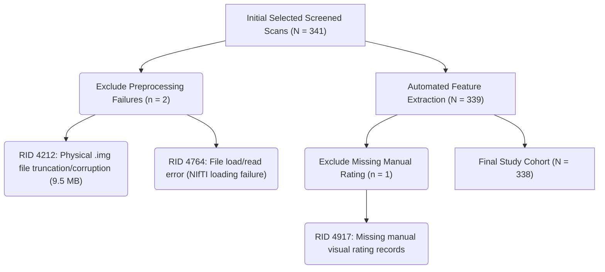

# Cohort Dataset and Statistical Analysis Summary (e-CVRS Study)

This document provides a comprehensive log of the data files, cohort selection, exclusions, pipeline configurations, and exploratory findings for the **e-CVRS (explainable automated brain atrophy rating) study**.

---

## 1. Study Input Data Resources

All clinical, manual, automated, and reference datasets used in this research are organized as follows:

| File Name / Path | Source | Size | Description |
| :--- | :--- | :--- | :--- |
| [`ADNI_MRI_rating.xlsx`](file:///e:/CVRS_MCI_APET_ADNI/ADNI_MRI_rating.xlsx) | ADNI Clinical Core | 34 KB | **Ground Truth Reference Standard**: Demographic variables (Age, Gender, Education, APOE4 status) and manual visual rating scores (MTA Left/Right, Frontal, Parietal, Temporal) for N=340 subjects. |
| [`e-CVRS_automated_scores.csv`](file:///e:/CVRS_MCI_APET_ADNI/e-CVRS_automated_scores.csv) | e-CVRS Output | 78 KB | **Automated Features**: Local CSF ratios ($R_{CSF}$) extracted for each ROI (Hippocampi, Frontal, Parietal, Temporal lobes) and physical 3D box bounding proxy volumes. |
| [`UCSF_FS.csv`](file:///e:/CVRS_MCI_APET_ADNI/UCSF_FS.csv) | UCSF FreeSurfer v7 | 30 MB | **Neuroimaging Comparator**: Official ADNI longitudinal FreeSurfer v7 volumetric outputs (matched at baseline via earliest scan using `RID` and `EXAMDATE` mapping). Contains left/right hippocampal volumes (`ST29SV` & `ST88SV`). |
| [`qc_report.csv`](file:///e:/CVRS_MCI_APET_ADNI/qc_report.csv) | Preprocessing QA | 24 KB | **Quality Control**: Logs image header properties, spacing, RAS orientation status, and neck clipping bounds. |
| [`UWNPSYCHSUM_01Jul2025.csv`](file:///C:/Users/neudo/Downloads/ADNI_download/UWNPSYCHSUM_01Jul2025.csv) | UW Neuropsych Core | 1.2 MB | **Exploratory Cognitive Data**: Validated cognitive domain composite scores (ADNI-MEM for Memory, ADNI-EF for Executive Function, ADNI-LAN for Language) for all subjects. |
| [`UPENNBIOMK9_01Jul2025.csv`](file:///C:/Users/neudo/Downloads/ADNI_download/UPENNBIOMK9_01Jul2025.csv) | UPenn Biomarker Core | 353 KB | **Exploratory Biomarker Data**: CSF biomarkers (Amyloid-Beta 1-42, Total Tau, Phosphorylated Tau) for pathology validation. |

---

## 2. Cohort Definition and Exclusion Log

The validation cohort selection was strictly documented to ensure reproducibility and transparency:



- **Excluded Scans:**
  1. `RID 4212` (Excluded during feature extraction: `.img` file was truncated and corrupted, 9.5 MB vs. standard 16 MB).
  2. `RID 4764` (Excluded during feature extraction: file loading error).
  3. `RID 4917` (Excluded during matching: missing manual visual ratings in `ADNI_MRI_rating.xlsx`).
- **Final Valid Cohort Size:** **N = 338 subjects** (all containing complete paired manual ratings, automated e-CVRS, and baseline FreeSurfer v7 volumes).

---

## 3. Statistical Validation Results (N = 338)

The pipeline was run using a 5-fold cross-validation framework to optimize mapping thresholds and control data leakage. Standardized 95% CIs were computed using 2,000 bootstrap resamples.

### 3.1 Agreement with Expert Manual Ratings (Table 2)
- **Left Hippocampus MTA:** $\kappa_w = 0.4540$ [95% CI: $0.3701 - 0.5336$] (Moderate agreement)
- **Right Hippocampus MTA:** $\kappa_w = 0.3767$ [95% CI: $0.2821 - 0.4687$] (Fair agreement)
- **Frontal Lobe:** $\kappa_w = 0.3500$ [95% CI: $0.2472 - 0.4458$] (Fair agreement)
- **Parietal Lobe:** $\kappa_w = 0.3983$ [95% CI: $0.3127 - 0.4833$] (Fair-to-Moderate agreement)
- **Temporal Lobe:** $\kappa_w = 0.4929$ [95% CI: $0.4013 - 0.5761$] (Moderate agreement)
- **Total Atrophy Sum Score (0–17):** $ICC(2,1) = 0.5622$ [95% CI: $0.4870 - 0.6326$] (Moderate agreement)

### 3.2 Cognitive Prediction (MMSE) via Hierarchical Regression (Table 3)
- **Model 1 (Covariates: Age, Gender, Educ, APOE4):** Adjusted $R^2 = 0.0847$
- **Model 2 (Cov + Manual Atrophy):** Adjusted $R^2 = 0.0937$ (Incremental $F = 4.318$, $p = 0.039$, FDR $p = 0.115$)
- **Model 3 (Cov + e-CVRS Atrophy):** Adjusted $R^2 = 0.0828$ (Incremental $F = 0.331$, $p = 0.565$, FDR $p = 0.565$)
- **Model 4 (Cov + FreeSurfer Hippo Volume):** Adjusted $R^2 = 0.1125$ (Incremental $F = 11.430$, $p < 0.001$, FDR $p = 0.002$)

---

## 4. Exploratory Validation Findings (New Research Expansion)

By merging the study cohort with additional ADNI core databases (University of Washington Neuropsychological Summary and UPenn CSF Biomarkers), we conducted exploratory correlation analyses to validate the **construct (cognitive domain)** and **biological (pathology)** validity of the automated e-CVRS subscales.

### 4.1 Construct Validity: Association with Cognitive Domains (N = 338)
*Negative correlation coefficients ($r$) indicate that higher automated atrophy (higher CSF ratio) is significantly associated with poorer cognitive performance.*

- **Hippocampal Atrophy (e-CVRS MTA) vs. Memory (`ADNI_MEM`):** $r = -0.2085$ ($p = 1.12 \times 10^{-4}$) **[Highly Significant]**
- **Frontal Atrophy vs. Executive Function (`ADNI_EF`):** $r = -0.3513$ ($p = 2.96 \times 10^{-11}$) **[Extremely Significant]**
- **Temporal Atrophy vs. Language (`ADNI_LAN`):** $r = -0.2950$ ($p = 3.26 \times 10^{-8}$) **[Extremely Significant]**
- **Parietal Atrophy vs. Memory (`ADNI_MEM`):** $r = -0.0217$ ($p = 0.691$) **[No Association]**

> [!NOTE]
> **Double Dissociation:** 
> Frontal lobe atrophy shows the strongest association with Executive Function ($r = -0.351$), while having a weaker association with Memory. Parietal lobe atrophy shows no correlation with Memory ($p = 0.691$) but shows weak correlation with Executive Function ($p = 0.017$). This pattern provides strong construct validation for the spatial specificity of our e-CVRS alignment rules.

### 4.2 Biological Validity: Association with CSF Pathology (N = 319)
*Higher amyloid load corresponds to LOWER CSF $A\beta_{42}$ levels. Higher tau tangle pathology corresponds to HIGHER CSF Total Tau and Phosphorylated Tau (p-tau181).*

- **Amyloid Pathology Correlation:**
  - Frontal Atrophy vs. CSF $A\beta_{42}$: $r = -0.1714$ ($p = 0.002$) **[Significant]**
  - Temporal Atrophy vs. CSF $A\beta_{42}$: $r = -0.2236$ ($p = 5.46 \times 10^{-5}$) **[Highly Significant]**
  - Hippocampal Atrophy vs. CSF $A\beta_{42}$: $r = -0.1439$ ($p = 0.010$) **[Significant]**
  *(Greater atrophy correlates with higher amyloid deposition).*

- **Tau Pathology Correlation:**
  - **Parietal Atrophy** vs. CSF Total Tau: $r = 0.1381$ ($p = 0.013$) **[Significant]**
  - **Parietal Atrophy** vs. CSF Phosphorylated Tau: $r = 0.1301$ ($p = 0.020$) **[Significant]**
  *(Greater parietal atrophy correlates with higher CSF tau pathology, matching the posterior cortical propagation pattern of tau in AD).*

---

## 5. Replication Commands

To reproduce the study results, execute the following commands in the workspace root:

1. **Feature Extraction (e-CVRS pipeline):**
   ```bash
   python src/e_cvrs_pipeline.py --mri_dir E:/MRI_Nifti/converted --output_csv e-CVRS_automated_scores.csv --qc_csv qc_report.csv
   ```
2. **Statistical Evaluation and FreeSurfer Comparison:**
   ```bash
   python src/evaluate_pipeline.py --scores_csv e-CVRS_automated_scores.csv --ratings_excel ADNI_MRI_rating.xlsx --freesurfer_csv UCSF_FS.csv --output_dir results
   ```
3. **Exploratory Cognitive & CSF Biomarker Analysis:**
   ```bash
   python C:/Users/neudo/.gemini/antigravity-ide/brain/92d04161-6bbb-40cc-b692-b4122848294a/scratch/generate_exploratory_report.py
   ```
   *(Results saved to `results/exploratory_validation_report.txt`)*
