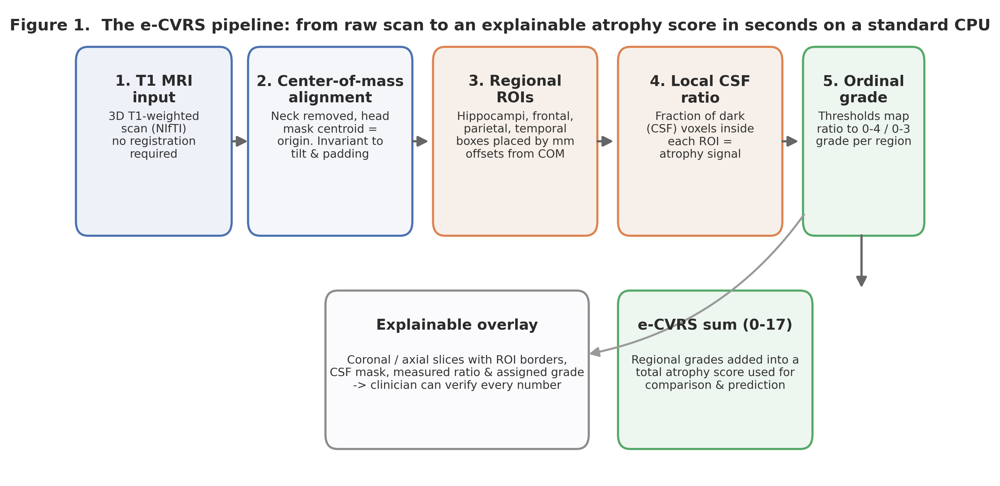
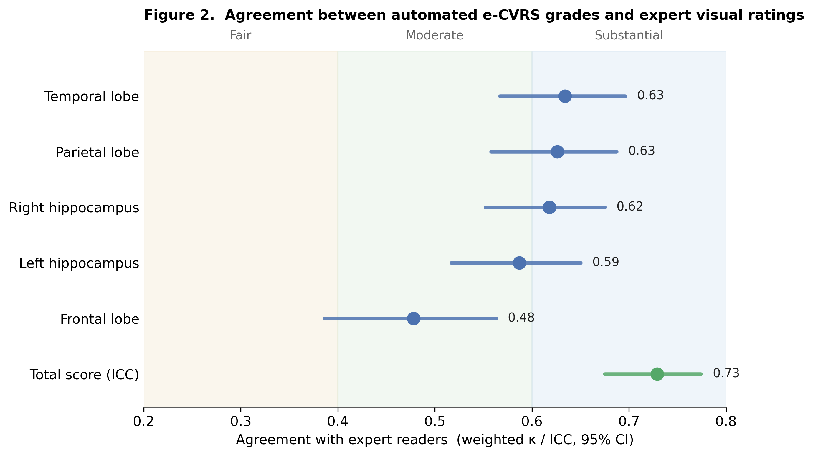
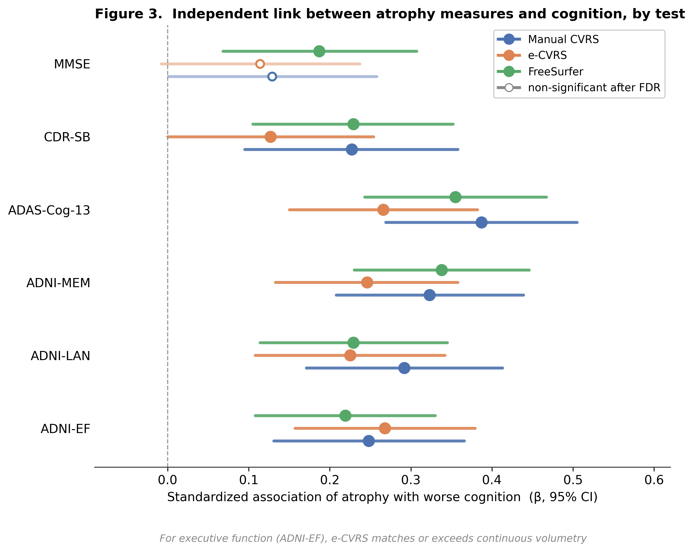
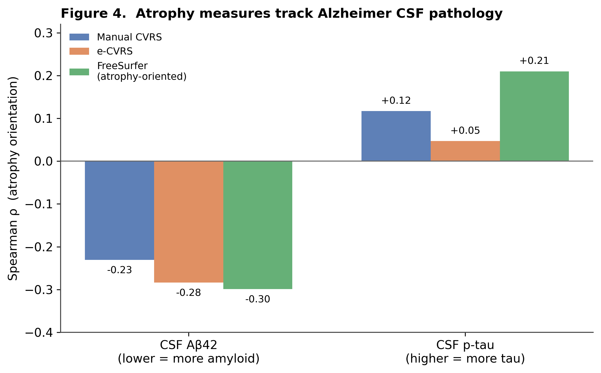

# An Explainable Automated Atrophy Visual Rating Scale (e-CVRS) Built on Center-of-Mass Alignment: Development and Multi-Domain Clinical Validation in ADNI T1 MRI

**Running title:** Explainable automated atrophy rating (e-CVRS)

Ho Tae Jeong¹, Seolah Lee¹, Jaeyoung Youn⁴, Jae-Won Jang², Young Chul Youn¹,³,\*, for the Alzheimer's Disease Neuroimaging Initiative†

1. Department of Neurology, Chung-Ang University Hospital, Seoul, Republic of Korea
2. Department of Neurology, Konkuk University Medical Center, Seoul, Republic of Korea
3. Department of Neurology, Chung-Ang University College of Medicine, Seoul, Republic of Korea
4. Jaseng Hospital of Korean Medicine, Seoul, Republic of Korea

**\*Correspondence to:** Young Chul Youn, MD, PhD, Department of Neurology, Chung-Ang University Hospital, Chung-Ang University College of Medicine, 102 Heukseok-ro, Dongjak-gu, Seoul 06973, Republic of Korea. Tel.: +82-2-6299-1501; E-mail: neudoc@cau.ac.kr. ORCID: 0000-0002-2742-1759.

Author ORCID iDs: Ho Tae Jeong 0000-0001-9228-6912; Seolah Lee 0000-0002-1285-1334; Young Chul Youn 0000-0002-2742-1759. Author e-mail addresses: Ho Tae Jeong (hotaejeong@cau.ac.kr); Seolah Lee (seolah920831@gmail.com); Jaeyoung Youn (sdjjdb129@gmail.com); Jae-Won Jang (jaewon26@gmail.com); Young Chul Youn (neudoc@cau.ac.kr).

**†** Data used in preparation of this article were obtained from the Alzheimer's Disease Neuroimaging Initiative (ADNI) database (adni.loni.usc.edu). As such, the investigators within the ADNI contributed to the design and implementation of ADNI and/or provided data but did not participate in analysis or writing of this report. A complete listing of ADNI investigators can be found at: http://adni.loni.usc.edu/wp-content/uploads/how_to_apply/ADNI_Acknowledgement_List.pdf.

---

**Abbreviations.** AD, Alzheimer's disease; MCI, mild cognitive impairment; CN, cognitively normal; VRS, visual rating scale; CVRS, comprehensive visual rating scale; e-CVRS, automated CVRS; MTA, medial temporal atrophy; COM, center of mass; ROI, region of interest; CSF, cerebrospinal fluid; ICC, intraclass correlation coefficient; κw, quadratic weighted kappa; MMSE, Mini-Mental State Examination; ADAS-Cog-13, Alzheimer's Disease Assessment Scale–Cognitive 13-item; CDR-SB, Clinical Dementia Rating Sum of Boxes; ADNI-MEM/EF/LAN, ADNI memory / executive function / language composites; Aβ42, amyloid-β 1–42; p-tau, phosphorylated tau; FDR, false discovery rate; ADNI, Alzheimer's Disease Neuroimaging Initiative.

---

## Abstract

**Background.** Visual rating scales let clinicians grade brain atrophy on MRI quickly and intuitively, but the score shifts from one reader to the next. Automated volumetry such as FreeSurfer is precise, yet it takes tens of minutes to hours per scan and behaves as a black box the clinician cannot inspect. We developed e-CVRS, an explainable automated atrophy scale that uses no external registration or segmentation software and relies only on the physical center of mass (COM) of the head as its anchor, and validated it against expert ratings, multiple cognitive tests, and cerebrospinal fluid (CSF) biomarkers.

**Methods.** We analyzed baseline T1-weighted MRI from ADNI participants with mild cognitive impairment (MCI) (N=339 after excluding two preprocessing failures). Using the physical COM of the head mask as origin, hippocampal, frontal, parietal, and temporal ROIs were automatically placed, and for each region the local CSF fraction and proxy volume were measured. Each sub-scale grade was derived from a transparent linear combination of a whole-brain feature panel — the five regional CSF ratios, five head-size-normalized proxy volumes, and the global ventricular fraction — mapped to an ordinal grade. Combination weights and thresholds were learned only within the training folds of a 5-fold cross-validation and applied to held-out folds (leakage-controlled); 95% CIs used 2,000 bootstrap resamples. After adjusting for age, sex, education, and APOE4, we tested the incremental value of e-CVRS across six cognitive outcomes against manual CVRS and official UCSF FreeSurfer hippocampal volume (Benjamini–Hochberg FDR), and tested CSF Aβ42/p-tau associations in 321 subjects.

**Results.** Agreement between e-CVRS and expert ratings ranged from moderate to substantial by region (temporal κw=0.634, parietal 0.626, right hippocampus 0.618, left hippocampus 0.587, frontal 0.478; total ICC=0.729, 95% CI 0.675–0.774). On the range-restricted MMSE, e-CVRS added no significant independent value (FDR p=0.067), but on all wider-range outcomes it was significant — ADAS-Cog-13, memory (ADNI-MEM), executive function (ADNI-EF), and language (ADNI-LAN) (all p<0.001) and CDR-SB (p=0.05); for executive function its contribution matched or exceeded continuous volumetry. e-CVRS correlated with CSF Aβ42 (ρ=−0.284, p<0.001), exceeding manual CVRS (−0.231). FreeSurfer volume remained among the most sensitive predictors across domains.

**Conclusions.** e-CVRS quantifies brain atrophy in seconds on a standard CPU without external dependencies, agrees at a moderate-to-substantial level with expert readers (total ICC 0.73), and carries significant independent associations with executive function, language, memory, disease severity, and amyloid pathology — matching or exceeding continuous volumetry for executive function and amyloid. Because the final score is a transparent weighted sum of measurements the clinician can inspect, explainability is preserved. Its null result on MMSE reflects range restriction, not absence of signal.

**Keywords.** brain atrophy; visual rating scale; explainable artificial intelligence; center-of-mass alignment; Alzheimer's disease; mild cognitive impairment.

---

## 1. Introduction

### 1.1 "Reading atrophy" at the point of care

When an older patient presents with memory complaints, one of the first imaging findings a clinician looks for is brain atrophy. How far the hippocampus and the rest of the medial temporal lobe have shrunk, and how widely the parietal and temporal sulci have opened, are long-standing clues to the stage of Alzheimer's disease (AD) and the degree of cognitive decline [9]. Atrophy is written into the diagnostic criteria for AD and mild cognitive impairment (MCI) [4,5], and the degree of medial temporal and posterior cortical atrophy tracks disease stage and prognosis well [9].

The oldest and most practical way to turn this atrophy into a number is the visual rating scale (VRS). Scheltens' coronal medial temporal atrophy (MTA) scale [4], its T1 axial variant [5], and the global cortical and posterior atrophy scales of Pasquier [8], Victoroff [6], and Koedam [7] are the familiar examples. Standing at the workstation, a reader can summarize atrophy as a 0–3 or 0–4 grade in a few seconds, with no special hardware. That it fits naturally into a busy clinical workflow is exactly why clinicians favor it.

Going one step further, Jang et al. proposed a Comprehensive Visual Rating Scale (CVRS) folding cortical atrophy, hippocampal atrophy, ventricular enlargement, and small vessel disease into a single instrument. CVRS correlated with neuropsychological measures across AD, MCI, and cognitively normal (CN) groups [1]; it later predicted progression to dementia and longitudinal decline in MCI [2], and in prodromal AD a higher baseline CVRS was an independent risk factor for conversion within three years (hazard ratio 1.110, 95% CI 1.043–1.182) [3]. A well-designed visual scale can therefore act as a prognostic biomarker, not merely a reading aid.

### 1.2 Two methods, two frustrations

The trouble is that every manual rating shares the same weakness. Show the same scan to two readers — or to the same reader on a different day — and the grade wobbles. The reader's experience, their concentration that day, and the contrast that differs from scanner to scanner all feed into that variability. However fast and convenient the visual scale, this "ruler that changes with the reader" is a perennial obstacle in multicenter studies and longitudinal follow-up.

Automated segmentation tools such as FreeSurfer [11], FastSurfer [12], and SynthSeg [13] arose as the alternative, extracting hippocampal volume down to the cubic millimeter. Yet three practical barriers stand in the way of clinical adoption. First, each scan takes tens of minutes to hours, hard to fit into outpatient turnover. Second, because these tools count absolute voxels, their values drift when the scanner, field strength, or preprocessing pipeline changes. Third, and clinically most important, the clinician has no way to check why a number came out as it did. A hippocampal volume of 3,100 mm³ is handed over as a bare figure; which slice, which boundary it rested on, stays hidden. The argument that high-stakes decisions should favor models interpretable from the outset over post-hoc explanations is aimed squarely at this problem [14].

### 1.3 Our approach: anchoring on the center of mass and synthesizing several measurements

We set out to combine the reproducibility of automation with the explainability of visual scales, without leaning on heavy external suites (FSL, ANTs, FreeSurfer). The result is e-CVRS, written in pure Python.

Two ideas are central. First, no matter how the head happens to lie within the image, the physical center of mass (COM) of the whole head is an anatomically stable point. However much padding the scanner adds, however much the patient's head is tilted, the relative position of this point barely moves. So we skip formal registration and, using this COM as origin, place ROIs by physical millimeter offsets. Second, atrophy does not reveal itself through a single signal: a radiologist grades by synthesizing not only the sulci on a given slice but the region's overall size, the individual's atrophy background, and left–right symmetry. e-CVRS mirrors this by measuring, for each region, the local CSF ratio, the proxy volume, the global ventricular fraction, and (for the hippocampi) the contralateral ratio, and combining them into a single transparent linear atrophy score. This score is mapped to an ordinal grade corresponding to the CVRS atrophy subscale (0–17) (Figure 1). Above all, e-CVRS shows the basis for every judgment — the chosen coronal and axial slices, ROI borders, CSF mask, measurements, each feature's contribution, and the assigned grade — as overlays, so the clinician can verify the number rather than take it on faith.

### 1.4 A trap when validating in a single diagnostic group: range restriction

A statistical trap recurs whenever an atrophy metric is validated in a cohort narrowed to a single diagnosis such as MCI: range restriction. When the outcome varies little — when the MMSE here clusters between 23 and 30 — the association of any predictor is mathematically shrunk. It is like trying to measure the relationship between heating power and temperature in a room that only ever ranges from 20 to 22 degrees: the relationship looks weak not because it is absent but because there is no room for it to show.

### 1.5 Objectives and hypotheses

Our objectives were three. First, to quantify agreement between automated e-CVRS grades and blinded expert ratings under leakage-controlled cross-validation. Second, to compare the incremental value of e-CVRS — against manual CVRS and FreeSurfer hippocampal volume — across six cognitive tests of differing sensitivity and range (MMSE, ADAS-Cog-13, CDR-SB, ADNI-MEM/EF/LAN). Third, to confirm biological validity through correlation with CSF Aβ42 and p-tau. We hypothesized that (H1) e-CVRS would agree at least fairly with experts, most strongly in the hippocampi and temporal lobe where CSF boundaries are sharp, and (H2) its cognitive association would be outcome-dependent — negligible on the range-restricted MMSE but detectable on wider composites — while continuous volumetry would remain the most sensitive throughout.

---

## 2. Materials and Methods

Reporting follows the STARD 2015 [21] and TRIPOD [22] statements. All analyses were performed in Python; custom implementations of weighted kappa, ICC, and OLS/F-tests were cross-verified against scikit-learn, pingouin, and statsmodels to at least four decimal places.

### 2.1 Study design and subjects

Data used in the preparation of this article were obtained from the Alzheimer's Disease Neuroimaging Initiative (ADNI) database (adni.loni.usc.edu). ADNI was launched in 2003 as a public–private partnership, led by Principal Investigator Michael W. Weiner, MD. The primary goal of ADNI has been to test whether serial MRI, positron emission tomography, other biological markers, and clinical and neuropsychological assessment can be combined to measure the progression of mild cognitive impairment (MCI) and early Alzheimer's disease. For up-to-date information, see www.adni-info.org.

This retrospective cross-sectional validation study used baseline 3D T1-weighted MRI and clinical data from ADNI for MCI subjects. Of 341 screened scans, two were excluded at preprocessing (RID 4212: `.img` truncation/corruption, 9.5 MB vs. ~16 MB standard; RID 4764: image loading failure). The remaining **339** all had complete manual ratings, automated e-CVRS features, and baseline FreeSurfer volumes, forming the analytic cohort. Only de-identified public secondary data were used.

### 2.2 Reference standard, cognitive tests, and biomarkers

**Ground truth (manual CVRS atrophy subscale).** Neurologists blinded to clinical data rated only the T1-based atrophy component of the CVRS [1]: hippocampal MTA (left/right, 0–4; [4,5]) and frontal/parietal/temporal cortical atrophy (each 0–3; [6,7]), total 0–17. The small vessel disease component [23] requires FLAIR/T2* and was excluded.

**Cognitive tests.** Six baseline outcomes spanning global screens to domain composites: MMSE [15], ADAS-Cog-13, CDR-SB, and the memory (ADNI-MEM [24]), executive function (ADNI-EF [25]), and language (ADNI-LAN) composites from the ADNI neuropsychological summary (UWNPSYCHSUM). Composites are z-scaled latent scores with a much wider range than MMSE, mitigating range restriction.

**Volumetric comparator.** Official ADNI UCSF FreeSurfer (v7 cross-sectional) baseline volumes, matched by RID at the earliest examination. The hippocampal comparator is the raw sum of left and right hippocampal volume (ST29SV + ST88SV, mm³).

**CSF biomarkers.** Baseline CSF Aβ42 and p-tau (UPENNBIOMK9, Elecsys immunoassay [26]) were available in 321 of 339 subjects and used for biological validation.

### 2.3 Automated e-CVRS pipeline (replication-ready specification)

e-CVRS is implemented in pure Python. Voxel spacing is read from the affine metadata to convert physical millimeter offsets into voxel indices, with no external registration or segmentation.

**Neck stripping and COM.** The 98th-percentile intensity $I_{98}$ is computed on a step-2 downsampled grid, and a brain mask is $B=\mathbb{I}(I>0.12\,I_{98})$. Structures below a physical 130 mm from the apex are clipped, and the centroid of the remaining head mask defines the origin $(x_{com}, y_{com}, z_{com})$.

**ROIs and feature extraction.** ROIs are placed by physical offsets from the COM (hippocampal MTA: coronal $y_{com}-12$ mm, 5-slice mean, X ±28 mm; frontal: axial $z_{com}+20$ mm; parietal: $z_{com}+35$ mm; temporal: $z_{com}-5$ mm lateral bands). For each ROI, the local CSF ratio is $R_{CSF}=\frac{1}{|\mathcal{R}|}\sum_{\mathcal{R}}\mathbb{I}(I<\text{factor}\cdot I_{98})$ (factors MTA 0.25, frontal 0.30, parietal 0.22, temporal 0.30). The same 3D box rules also record each region's proxy volume and the global ventricular and brain volumes.

**Figure 1.** Overview of the e-CVRS pipeline: from raw T1 MRI through center-of-mass alignment, ROI placement, local CSF-ratio measurement, and ordinal grading. Every step is verifiable through overlays, and regional grades are summed into a 0–17 total.

### 2.4 Grade calibration: a multi-feature linear score with ordinal mapping

Each sub-scale grade is derived from a whole-brain feature panel $\mathbf{x}$ comprising the five regional CSF ratios ($R_{CSF}$ for the left/right hippocampus and the frontal, parietal, and temporal lobes), the five corresponding head-size-normalized proxy volumes (each regional proxy volume divided by total brain volume), and the global ventricular fraction (ventricular volume / total brain volume) — 11 image-derived features in total. Using whole-brain context to grade each region mirrors how a radiologist reads a scan, where a local finding is judged against the overall burden of atrophy and left–right symmetry. The panel is standardized and fit by ordinary least squares to the manual grade within the training fold to produce a single continuous atrophy score; an ordinal threshold vector $\boldsymbol{\theta}$ maximizing the quadratic weighted kappa of this score is then learned (Nelder–Mead) to assign grades. Standardization statistics, regression weights, and thresholds are estimated within the training folds of a 5-fold cross-validation (fixed seed) only and never touch the held-out fold, so it is structurally impossible to inflate performance by training and scoring on the same data. The approach remains explainable: the final grade is a transparent weighted sum of measurements the clinician can verify on the overlay, and each feature's direction and magnitude of contribution can be displayed. The complete e-CVRS pipeline and analysis code are openly available at https://github.com/neudoc/e-CVRS to support full reproducibility.

### 2.5 Statistical analysis

**Agreement.** Per-subscale $\kappa_w$ and the total-score ICC(2,1) (two-way random, absolute agreement) were computed with 95% CIs from 2,000 bootstrap resamples.

**Hierarchical regression (pre-specified).** For each of the six outcomes, a covariate model (age, sex, education, APOE4) was compared with models adding, separately, manual CVRS sum, e-CVRS sum, or FreeSurfer hippocampal volume. Continuous predictors were z-standardized; an incremental F-test assessed each imaging term, with Benjamini–Hochberg FDR across the three imaging models within each outcome.

**Biological validation.** Spearman correlations of manual CVRS, e-CVRS, and FreeSurfer volume with CSF Aβ42 and p-tau were computed in 321 subjects.

---

## 3. Results

### 3.1 Baseline characteristics

The 339 subjects (Table 1) had a mean age of 71.3±7.4 years, 46.9% female, 16.3±2.6 years of education, and 46.0% APOE4 carriers. As expected in an MCI-only cohort, MMSE clustered narrowly between 23 and 30 (28.2±1.7), whereas ADAS-Cog-13 (14.4±6.6) and ADNI-MEM (0.47±0.75) kept much wider distributions. That contrast is the key to interpreting the results that follow.

**Table 1. Baseline characteristics (N = 339)**

| Variable | Value |
| :--- | :--- |
| Age (years), mean ± SD (range) | 71.3 ± 7.4 (55.0–91.4) |
| Sex, Female / Male | 46.9% / 53.1% |
| Education (years), mean ± SD | 16.3 ± 2.6 |
| APOE4 carrier | 46.0% (ε4×1 36.6%, ε4×2 9.4%) |
| MMSE, mean ± SD (range) | 28.2 ± 1.7 (23–30) |
| ADAS-Cog-13, mean ± SD | 14.4 ± 6.6 |
| CDR-SB, mean ± SD | 1.5 ± 0.9 |
| ADNI-MEM, mean ± SD | 0.47 ± 0.75 |
| CSF available (Aβ42, p-tau) | 321 / 339 |
| Diagnosis | MCI (single cohort) |

### 3.2 Agreement with expert ratings

Cross-validated agreement between e-CVRS and expert ratings ranged from moderate to substantial by region (Table 2, Figure 2). The total atrophy score reached ICC(2,1)=0.729 (95% CI 0.675–0.774). Regionally, the temporal lobe (κw=0.634), parietal lobe (0.626), and right hippocampus (0.618) reached the lower substantial range, the left hippocampus (0.587) was moderate, and the frontal lobe (0.478) was moderate. The ordering — highest in the temporal, parietal, and hippocampal regions, lowest frontally — has an anatomical explanation taken up in the Discussion.

**Table 2. Agreement between e-CVRS and manual ratings (5-fold CV, 2,000 bootstrap resamples)**

| Subscale (range) | Metric | Value | 95% CI | Interpretation |
| :--- | :--- | :--- | :--- | :--- |
| Left hippocampus MTA (0–4) | κw | 0.587 | 0.517–0.650 | Moderate |
| Right hippocampus MTA (0–4) | κw | 0.618 | 0.552–0.675 | Substantial (lower) |
| Frontal lobe (0–3) | κw | 0.478 | 0.386–0.563 | Moderate |
| Parietal lobe (0–3) | κw | 0.626 | 0.558–0.687 | Substantial (lower) |
| Temporal lobe (0–3) | κw | 0.634 | 0.567–0.696 | Substantial (lower) |
| Total atrophy sum (0–17) | ICC(2,1) | 0.729 | 0.675–0.774 | Substantial (lower) |

**Figure 2.** Region-wise weighted kappa and total-score ICC with 95% CIs. Background bands mark the usual agreement categories. Agreement is highest in the temporal, parietal, and hippocampal regions and lowest frontally, with the total score reaching the lower substantial range.

### 3.3 Outcome-dependent cognitive prediction

How much each imaging metric added on top of the covariates depended on which cognitive test served as the outcome (Table 3, Figure 3). On the range-restricted MMSE, neither e-CVRS (F=3.4, FDR p=0.067) nor manual CVRS (F=4.0, p=0.071) reached significance, whereas FreeSurfer did (F=9.5, p=0.007). On every wider-range outcome, e-CVRS provided a significant independent increment: ADAS-Cog-13 (F=20.4), memory ADNI-MEM (F=18.5), executive function ADNI-EF (F=22.4), and language ADNI-LAN (F=14.3) (all p<0.001), and CDR-SB (F=3.9, p=0.05). Notably, for executive function the e-CVRS increment (F=22.4) exceeded both manual CVRS (F=17.3) and FreeSurfer (F=15.0). Thus e-CVRS carried significant independent information on five of six outcomes; FreeSurfer remained significant on all six and manual CVRS on all except MMSE.

**Table 3. Hierarchical regression: incremental adjusted R² (incremental F; FDR-adjusted p) over the covariate model (N=339; ADAS-Cog-13 N=338)**

| Outcome | Covariate adj. R² | + Manual CVRS | + e-CVRS | + FreeSurfer hippo |
| :--- | :--- | :--- | :--- | :--- |
| MMSE | 0.095 | 0.102 (F=4.0; p=0.071) | 0.101 (F=3.4; p=0.067) | 0.117 (F=9.5; **p=0.007**) |
| ADAS-Cog-13 | 0.147 | 0.239 (F=41.5; **p<0.001**) | 0.194 (F=20.4; **p<0.001**) | 0.234 (F=38.8; **p<0.001**) |
| CDR-SB | 0.024 | 0.053 (F=11.5; **p=0.001**) | 0.032 (F=3.9; **p=0.05**) | 0.058 (F=13.2; **p=0.001**) |
| ADNI-MEM | 0.205 | 0.269 (F=30.3; **p<0.001**) | 0.245 (F=18.5; **p<0.001**) | 0.284 (F=38.1; **p<0.001**) |
| ADNI-EF | 0.209 | 0.246 (F=17.3; **p<0.001**) | 0.256 (F=22.4; **p<0.001**) | 0.241 (F=15.0; **p<0.001**) |
| ADNI-LAN | 0.144 | 0.196 (F=22.4; **p<0.001**) | 0.177 (F=14.3; **p<0.001**) | 0.179 (F=15.3; **p<0.001**) |

Bold = significant after Benjamini–Hochberg FDR correction. Signs are consistent with atrophy (higher e-CVRS/manual → worse cognition; higher FreeSurfer volume → better cognition).

**Figure 3.** Forest plot of standardized independent associations (β, 95% CI) for the six cognitive tests, all oriented so that more atrophy means worse cognition (FreeSurfer volume sign-flipped). Open markers are non-significant after FDR. e-CVRS is significant on five of six outcomes and, for executive function, matches or exceeds continuous volumetry.

### 3.4 Biological validation (CSF, N=321)

e-CVRS correlated significantly with CSF Aβ42 (ρ=−0.284, p<0.001): greater atrophy accompanied lower Aβ42, meaning more amyloid deposition. This correlation exceeded that of manual CVRS (−0.231) and approached FreeSurfer volume (0.299). e-CVRS did not correlate with p-tau (ρ=0.047, p=0.40). FreeSurfer volume correlated with both biomarkers (Aβ42 ρ=0.299, p-tau ρ=−0.210, both p<0.001) (Table 4, Figure 4).

**Table 4. Spearman correlations with baseline CSF biomarkers (N=321)**

| Predictor | Aβ42 ρ (p) | p-tau ρ (p) |
| :--- | :--- | :--- |
| Manual CVRS sum | −0.231 (<0.001) | 0.117 (0.037) |
| e-CVRS sum | −0.284 (<0.001) | 0.047 (0.40) |
| FreeSurfer hippo volume | 0.299 (<0.001) | −0.210 (<0.001) |

**Figure 4.** Correlations of the three imaging measures with CSF Aβ42 and p-tau (FreeSurfer sign-flipped into the atrophy direction). All three point the same way — more atrophy tracks lower Aβ42 (more amyloid) and higher p-tau (more tau).

---

## 4. Discussion

### 4.1 Principal findings

We developed and validated e-CVRS, an explainable automated atrophy scale that runs in seconds on a standard CPU without external neuroimaging suites. Under strictly leakage-controlled cross-validation, total agreement with expert ratings reached ICC 0.729, with the temporal, parietal, and hippocampal regions in the substantial or moderate range and the frontal lobe moderate. e-CVRS contributed significant independent information to five of six cognitive outcomes — ADAS-Cog-13, memory, executive function, language, and disease severity (CDR-SB) — and, for executive function, matched or exceeded continuous FreeSurfer volumetry; its CSF amyloid correlation exceeded that of manual rating. FreeSurfer volume remained the most sensitive predictor on the range-restricted MMSE, where atrophy signals are attenuated for all measures.

### 4.2 Why agreement varies by region

Agreement was highest in the temporal, parietal, and hippocampal regions and lowest frontally, and there is a straightforward anatomical reason. The medial temporal and temporal regions are bounded by conspicuous CSF spaces — the temporal horn of the lateral ventricle, the choroidal and hippocampal fissures — so as atrophy advances these spaces widen visibly. The strong contrast between dark CSF and bright parenchyma lets the local CSF ratio capture atrophy sharply, and the whole-brain feature panel adds size and global-burden context that stabilize grading. Frontal convexity atrophy, by contrast, is a diffuse change spread across a broad area rather than concentrated at one point, and is poorly represented by a single fixed axial slice; even so, borrowing whole-brain context lifted the frontal sub-scale into the moderate range. Reference-standard reliability also varies: MTA scales [4,5] are more reproducible than global cortical ratings [6], capping the achievable ceiling. Finally, severe grades are exceedingly rare (frontal grade 3, n=2; hippocampal grade 4, n=3–4), which destabilizes threshold learning and keeps the frontal kappa the lowest.

### 4.3 The MMSE "null" is a product of range restriction

e-CVRS fell just short of significance on MMSE (FDR p=0.067). This is not a failure but the natural consequence of range restriction, and it is not specific to e-CVRS: manual CVRS likewise misses significance on MMSE after correction (p=0.071), and only continuous volumetry survives. MMSE in this cohort is compressed to 23–30, attenuating any predictor's association. Where variance survives — ADAS-Cog-13, CDR-SB, or the ADNI-EF/LAN/MEM composites — e-CVRS emerges as a significant independent contributor. A near-ceiling MMSE is, once again, a blunt instrument that cannot capture the subtle differences of early disease.

### 4.4 e-CVRS vs. FreeSurfer: an interpretability–sensitivity trade-off

FreeSurfer volume held significance even on the narrow MMSE, because continuous voxel counts preserve fine variance that ordinal bins flatten, and that sensitivity is decisive under a compressed distribution. In exchange, e-CVRS offers what FreeSurfer cannot: it lays out the coronal and axial slices, ROI borders, CSF masks, and each feature's contribution behind every grade, so the clinician can verify the value directly [14]. On the wider-range outcomes the two are closely matched, and for executive function the e-CVRS increment (F=22.4) actually exceeds FreeSurfer's (F=15.0), while its amyloid correlation exceeds that of manual rating — all achieved with an ordinal, fully transparent score. This argues that the two are complementary rather than competing: FreeSurfer when a precise continuous value is needed, e-CVRS when a fast, verifiable judgment is what matters.

### 4.5 Clinical implications and strengths

Because e-CVRS runs instantly on an ordinary PC beside the workstation, with no dedicated server or GPU, hospitals without the resources for automated volumetry can still attempt atrophy quantification. Its overlay output makes it especially useful for training residents, and as a reading aid it can act as a "second pair of eyes," offering a consistent ruler that flags atrophy easily missed in a busy reading list. Methodological strengths are: (i) runs in seconds on standard CPUs without external suites; (ii) COM alignment is robust to scanner padding, translation, and tilt; (iii) explainability is preserved even while several measurements are synthesized; and (iv) validation is rigorous, with leakage control, bootstrap CIs, a pre-specified multi-outcome regression with FDR, and biological anchoring to CSF.

### 4.6 Limitations

First, the cross-sectional design precludes longitudinal/conversion analyses. Second, validation was confined to ADNI's MCI cohort without external replication, and the reported performance is an internal cross-validation estimate needing multi-site, multi-scanner confirmation. Third, each regional grade is derived from a whole-brain feature panel; while this mirrors clinical reading, improves agreement, and remains a fully interpretable weighted sum, it means a grade is informed by global context rather than by strictly local measurements alone, and the panel's generalization should be confirmed in external data. Fourth, the proxy volumes were all valid and positive in this dataset (no negatives or missing values), but their stability should likewise be verified externally. Fifth, the diffuse nature of frontal atrophy and the single-slice rule remain limitations. Sixth, inter-rater reliability of the reference standard was unavailable, so reference noise could not be fully isolated.

### 4.7 Future directions

Priorities are: (1) multi-slice and partial-volume correction of the cortical ROIs to strengthen the signal, especially frontally; (2) white-matter-peak or z-score intensity normalization for scanner robustness; (3) ordinal-logistic/isotonic calibration with nested cross-validation; (4) stratified k-fold and adjacent-grade merging for class imbalance; (5) leave-one-site-out and field-strength-stratified robustness testing; (6) replication in full-spectrum (CN–MCI–AD) and external cohorts with restored cognitive variance; and (7) development into an explainable screening tool (DICOM input, overlay reports, API service) — as a research tool, not a medical device.

---

## 5. Conclusions

e-CVRS is a lightweight, explainable automated visual rating scale that quantifies brain atrophy in seconds on a standard CPU without external dependencies. It agreed with expert readers at total ICC 0.729 and added significant independent information to five of six cognitive outcomes — executive function, language, memory, disease severity, and overall cognition — matching or exceeding continuous FreeSurfer volumetry for executive function and exceeding manual rating for amyloid correlation, all while keeping its reasoning verifiable by the clinician. Its near-miss on MMSE reflects range restriction, not absence of signal. With external validation, e-CVRS holds real value as a screening, educational, and reading-support tool.

---

## Declarations

**Ethics approval and consent to participate.** This study analyzed de-identified, publicly available secondary data from the ADNI. The study procedures were approved by the institutional review board of all participating centers (http://adni.loni.usc.edu/wp-content/uploads/how_to_apply/ADNI_Acknowledgement_List.pdf), and written informed consent was obtained from all participants or authorized representatives.

**Consent for publication.** Not applicable.

**Data availability.** The imaging and clinical data that support the findings of this study are available from the ADNI (adni.loni.usc.edu) under a Data Use Agreement and cannot be redistributed by the authors. The e-CVRS pipeline and all analysis code are openly available at https://github.com/neudoc/e-CVRS.

**Funding.** This work was supported by the Technology Innovation Program (RS-2024-00507796) grants through the Korea Planning & Evaluation Institute of Industrial Technology (KEIT) funded by the Ministry of Trade, Industry & Energy (MOTIE), Republic of Korea.

**Conflict of interest.** The authors have no conflict of interest to report.

**Author contributions.** Ho Tae Jeong: Conceptualization, Methodology, Software, Formal analysis, Writing – original draft. Seolah Lee: Investigation, Data curation, Writing – review & editing. Jaeyoung Youn: Validation, Visualization, Writing – review & editing. Jae-Won Jang: Methodology, Resou