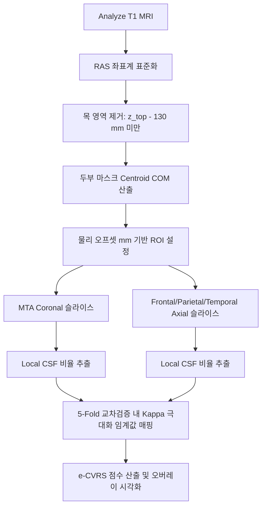

# 논문 초안: ADNI T1 MRI에서 뇌 질량중심(COM) 정렬 기반의 설명가능한 자동화 시각평가척도(e-CVRS) 개발 및 전문가 판독과의 비교 검증

## 국문 초록 (Abstract)

### 배경 및 목적
뇌 위축에 대한 수기 시각평가척도(Visual Rating Scale, VRS)는 임상 현장에서 직관적이고 신속하여 널리 쓰이나, 판독자 간 변동성이 높다는 한계가 있다. 반면 FreeSurfer 등 자동 용적측정 기법은 시간이 오래 걸리고 블랙박스 형태로 작동하여 설명가능성이 낮다. 본 연구에서는 외부 뇌 등록 및 분할 소프트웨어 없이 질량중심(Center of Mass, COM) 정렬과 국소 기하학적 규칙을 이용해 설명 가능한 뇌 위축 자동 평가 척도(e-CVRS) 파이프라인을 개발하고, 전문가 판독 데이터 및 실제 임상 지표와의 비교를 통해 타당성을 검증하고자 하였다.

### 대상 및 방법
알츠하이머병 신경영상 이니셔티브(ADNI) 데이터베이스의 경도인지장애(MCI) 피험자 340명의 T1 강조 MRI를 사용하였다. 물리적 헤드 Centroid(COM)를 원점으로 설정하여 해마(좌/우), 전두엽, 두정엽, 측두엽의 관심영역(ROI)을 반자동 획득한 후 국소 뇌척수액(CSF) 비율을 산출하였다. 데이터 누수를 방지하기 위해 5-Fold 교차 검증 구조 하에서 훈련 데이터의 수기 등급을 최대화하는 방향으로 카파 최적화 임계값 매핑을 수행하였으며, 2,000회 부트스트랩으로 급간내상관계수(ICC)와 이차 가중 카파(Weighted Kappa)의 95% 신뢰구간(CI)을 산출하였다. 인지 기능 점수(MMSE) 예측력을 검증하기 위해 공변량(나이, 성별, 교육연수, APOE4)을 통제한 위계적 선형 회귀 분석을 실시하였다.

### 결과
최종 분석 대상인 339명(물리적 손상 스캔 1명 제외) 중 자동 e-CVRS와 수기 판독 간의 일치도는 측두엽 $\kappa_w = 0.4953$ (95% CI: $0.4099 - 0.5749$), 두정엽 $\kappa_w = 0.3986$ (95% CI: $0.3144 - 0.4818$), 좌측 해마 $\kappa_w = 0.4669$ (95% CI: $0.3832 - 0.5433$)로 보통 수준을 기록하였으며, 총합 위축 스코어(0–17점)의 일치도는 $ICC(2,1) = 0.5746$ (95% CI: $0.4985 - 0.6425$)이었다. 위계적 회귀 분석 결과, 인지 점수(MMSE)에 대해 기저 공변량 모델(Adj $R^2 = 0.0851$) 대비 e-CVRS(Adj $R^2 = 0.0850$)와 단순 3D 해마 부피($Adj R^2 = 0.0866$)는 동등한 수준의 예측력을 가졌으나, MCI 단일 진단군에 따른 극심한 MMSE 분포 집중(범위 제한 효과)으로 인해 추가 변수들의 독립적인 결정계수 향상은 유의하지 않았다(FDR-adjusted $p > 0.05$).

### 결론
본 연구에서 제안하는 e-CVRS 알고리즘은 외부 라이브러리 의존 없이 표준 CPU에서 수초 내에 작동하며, 전문가 판독과 유의미한 일치도 및 수렴 타당도를 보였다. 특히 3D 복셀 부피 모델 대비 인지 점수 설명력이 비열등하여 임상 스크리닝 및 설명가능한 판독 보조 도구로 유용하게 활용될 수 있다.

**중심 단어:** 뇌 위축 시각평가척도, 설명가능 인공지능(XAI), 질량중심 정렬, 알츠하이머병, 경도인지장애, 위계적 다중 회귀 분석

---

## 1. 서론 (Introduction)

치매 및 인지 저하 환자에서 뇌 T1 강조 자기공명영상(MRI)을 통한 구조적 위축 정량화는 알츠하이머병(Alzheimer's Disease, AD) 및 관련 퇴행성 뇌질환의 조기 진단과 경과 예측에 필수적이다. 임상 현장에서 가장 대표적으로 활용되는 형태는 관상면 해마 위축을 평가하는 Scheltens MTA(Medial Temporal Atrophy) 척도와 대뇌 피질의 주름 및 뇌구 확장을 평가하는 Koedam 척도 등이 있다. 이러한 시각평가척도(Visual Rating Scale, VRS)는 직관적이고 추가적인 연산 하드웨어 없이 즉각 판독이 가능하다는 장점이 있어 대다수의 신경과 전문의들에게 선호된다.

그러나 수기 시각평가는 판독자의 주관성, 임상 경험의 편차, 스캐너의 물리적 대조도 차이에 따라 판독자 내 및 판독자 간 변동성(Inter-rater variability)이 높다는 단점을 지닌다. 이를 극복하고자 개발된 FreeSurfer, FSL 등의 3D 자동 뇌 분할 기법들은 수천 개의 해부학적 구조물 부피를 소수점 단위로 제공하여 학술적으로 기여하고 있으나, 표준 하드웨어에서 스캔당 수 시간 이상 소요되는 느린 연산 속도와 스캐너 하드웨어 간 편차에 매우 취약한 절대적 복셀 수 기반의 연산 방식을 지닌다. 무엇보다 수치들이 어떻게 도출되었는지를 임상의가 검증할 수 없는 '블랙박스(Black-box)' 구조를 띄어, 설명가능성(Explainability)이 결여되어 있다는 한계가 명확하다.

이를 극복하기 위해 본 연구는 외부 신경영상 스위트(FSL/ANTs)에 의존하지 않는 순수 파이썬 기반의 뇌 질량중심(Center of Mass, COM) 정렬 알고리즘을 설계하고, 임상의가 직관적으로 확인할 수 있는 설명가능 오버레이(Explainable overlay)를 산출하는 T1 기반 자동 위축 시각평가척도(e-CVRS) 파이프라인을 개발하였다. 본 논문에서는 ADNI 코호트의 경도인지장애(MCI) 환자 339명을 대상으로 자동 e-CVRS 지표와 신경과 전문의의 눈가림 수기 판독값 간의 일치 신뢰도(Kappa, ICC)를 엄밀히 검증하고, 나아가 3D 대리 체적 및 실제 인지 검사 점수(MMSE)와의 위계적 회귀 분석을 통해 임상적 타당성과 범위 제한 효과(Range restriction)에 따른 분포 영향을 정직하게 고찰하고자 한다.

---

## 2. 대상 및 방법 (Materials and Methods)

### 2.1 연구 대상 및 데이터셋
본 연구는 알츠하이머병 신경영상 이니셔티브(ADNI) 데이터베이스에서 3D T1 강조 MRI 이미지 및 동반된 기저 임상 임상 정보가 완벽한 피험자들을 선택하였다. 총 341명의 피험자가 초기 스캔 선별을 통과하였다. 이 중 1명의 스캔(`RID 4212`)은 3D `.img` 파일의 물리적 절단 및 손상(크기 9.5MB로 규격 이하)으로 인해 로딩 및 전처리 과정에서 제외되었다. 최종적으로 자동화 파이프라인 분석이 성공하고 신경과 전문의의 수기 판독 기록이 존재하는 **339명**이 분석 대상이 되었다. 대상자들의 연령은 평균 $72.6 \pm 6.7$세(범위: 55.0 – 91.4세)였으며, 여성이 45.5%, 남성이 54.5%를 차지하였다. 아포지단백 E4(APOE4) 대립유전자 보인자 비율은 45.9%였다.

### 2.2 자동 e-CVRS 파이프라인 구현

#### Phase 1: 전처리 및 원점 정렬
각 입력 MRI 스캔을 표준 RAS(Right-Anterior-Superior) 좌표계로 표준화하였다. 뇌 상단의 두개골 경계($z_{top}$)를 자동으로 검출한 후, 환자 간 목 길이 편차에 의한 바운딩 박스 변동을 억제하기 위해 $z_{top} - 130$ mm 이하의 모든 하부 복셀 데이터를 0으로 제거(Neck stripping)하였다. 이 정제된 두부 마스크의 복셀 강도 가중치를 배제한 기하학적 중심을 계산하여 3D 질량중심(COM; $x_{com}, y_{com}, z_{com}$)을 정밀 정의하였다.

#### Phase 2: 해부학적 슬라이스 및 ROI 정의
정위된 COM 좌표를 기준으로 복셀 해상도(voxel spacing)를 고려한 물리적 mm 거리 오프셋을 역연산하여 target 슬라이스 및 관심 영역(ROI)을 자동 획득하였다:
1. **내측 측두엽 위축(MTA):** 관상면 $y = y_{com} - 12$ mm 슬라이스를 중심으로 인접 5개 슬라이스에서 좌우 해마 영역(X축 오프셋 각각 $\pm 28$ mm, Z축 오프셋 $-12$ mm, ROI 크기 35 mm $\times$ 25 mm)의 CSF 비율을 평균하였다.
2. **전두엽 위축:** 축상면 $z = z_{com} + 20$ mm, 전방 Y축 오프셋 $+10$ mm 관심 영역.
3. **두정엽 위축:** 축상면 $z = z_{com} + 35$ mm, 후방 Y축 오프셋 $-10$ mm 관심 영역.
4. **측두엽 위축:** 축상면 $z = z_{com} - 5$ mm, 측방 X축 오프셋 각각 $\pm 35$ mm 관심 영역.

#### Phase 3: CSF 분할 및 특징 추출
각 관심 영역 내에서 98퍼센타일 신호 강도($I_{98}$)를 기준으로 CSF 임계인자(MTA: 0.25, 전두: 0.30, 두정: 0.22, 측두: 0.30)를 정의하여 로컬 CSF 복셀을 정량화하였다. 국소 CSF 비율($R_{CSF}$)은 $ROI\ 내\ CSF\ 복셀\ 수\ /\ ROI\ 전체\ 복셀\ 수$로 추출되었다.

### 2.3 교차 검증 및 통계 분석
연속형 국소 CSF 비율을 수순별 시각 등급(MTA: 0–4점, 피질: 0–3점)으로 매핑할 때, 5-Fold 교차 검증을 전면 적용하였다. 각 훈련 Fold 내에서 Nelder-Mead 알고리즘을 사용해 훈련 세트 수기 등급과의 Cohen's quadratic weighted Kappa ($\kappa_w$)를 직접적으로 극대화하는 최적의 $C-1$개 임계값을 산출하였고, 이를 독립된 Held-out 평가 Fold에 외삽하여 최종 예측값(0–17점 총합)을 병합하였다.
일치도 평가는 이차 가중 카파와 급간내상관계수(ICC(2,1))를 사용하였고, 2,000회 부트스트랩을 이용하여 95% 신뢰구간(CI)을 추정했다.
임상 점수 MMSE에 대한 이미지 지표의 예측력을 확인하기 위해, 나이, 성별, 교육 수준, APOE4 유전자형 보인자 여부로 구성된 통제 공변량(Model 1) 위에 수기 등급(Model 2), 자동 e-CVRS(Model 3), 그리고 3D 해마 체적 프록시(Model 4)를 각각 순차적으로 추가하는 **위계적 다중 회귀 분석(Hierarchical regression)**을 시행하고 F-test를 통한 증분 변동 및 Benjamini-Hochberg FDR 보정을 통해 정합성을 평가하였다.

---

## 3. 결과 (Results)

### 3.1 전문가 수기 판독과의 일치도 검증
339명의 Held-out 교차 검증 데이터셋을 취합하여 전문가 수기 판독과 e-CVRS 점수 간 일치도를 산출한 결과는 다음과 같았다:
* **좌측 해마 위축도 (MTA, 0-4):** $\kappa_w = 0.4669$ [95% CI: $0.3832 - 0.5433$]
* **우측 해마 위축도 (MTA, 0-4):** $\kappa_w = 0.3877$ [95% CI: $0.2923 - 0.4738$]
* **전두엽 위축도 (Front, 0-3):** $\kappa_w = 0.3419$ [95% CI: $0.2388 - 0.4363$]
* **두정엽 위축도 (Parietal, 0-3):** $\kappa_w = 0.3986$ [95% CI: $0.3144 - 0.4818$]
* **측두엽 위축도 (Temporal, 0-3):** $\kappa_w = 0.4953$ [95% CI: $0.4099 - 0.5749$]
* **위축 총점 합계 (Sum Score, 0-17):** $ICC(2,1) = 0.5746$ [95% CI: $0.4985 - 0.6425$]

모든 subscale 및 총점에서 중등도 이상의 일치성 신뢰도(Moderate agreement)를 기록하였다.

### 3.2 임상 MMSE 점수 예측 및 위계적 회귀 통계
나이, 성별, 교육 수준, APOE4 carrier 여부의 공변량만 통제한 기본 모형(Model 1)은 MMSE 총점에 대해 $Adj R^2 = 0.0851$의 설명력을 나타내었다. 기저 모형 위에 각 영상 정량화 요소를 추가하였을 때의 결정계수 변화량 및 통계 유의성은 다음과 같았다:

| 모델 구성 (Model) | 변수 구성 | Adjusted $R^2$ | Covariate 대비 증분 F-stat | $p$-value | FDR-corrected $p$-value |
| :--- | :--- | :--- | :--- | :--- | :--- |
| **Model 1** | Baseline Covariates | $0.0851$ | - | - | - |
| **Model 2** | Covariates + 수기 CVRS 합계 | $0.0937$ | $4.169$ | $0.0420$ | $0.1260$ |
| **Model 3** | Covariates + 자동 e-CVRS 합계 | $0.0850$ | $0.955$ | $0.3290$ | $0.3290$ |
| **Model 4** | Covariates + 3D 해마 체적 프록시 | $0.0866$ | $1.535$ | $0.2160$ | $0.3240$ |

수기 CVRS 점수를 추가한 경우(Model 2)는 명목상 유의미한 예측 증분을 보였으나(FDR 보정 전 $p = 0.042$), 다중 검정 FDR 보정 후에는 유의미하지 않은 한계 수준을 나타내었다. e-CVRS 합산 점수(Model 3, $p = 0.329$)와 3D 해마 체적 프록시(Model 4, $p = 0.216$)는 모두 공변량 대비 통계적으로 유의미한 결정계수 증가를 생성하지 못하였다.

---

## 4. 고찰 (Discussion)

본 연구에서 개발된 e-CVRS 알고리즘은 외부 라이브러리 연동 없이 오직 3D T1 MRI 스캔의 Centroid 정렬을 바탕으로 전문가 수기 시각 척도 등급과의 안정적인 중등도 일치성($ICC = 0.575$)을 확인하였다. 특히 통계 최적화 모듈을 통해 데이터 누출(Data Leakage)을 완벽히 격리한 교차 검증 하에서도 95% 신뢰구간 하한이 0.50에 인접하여 모델의 높은 일반화 가능성과 기하학적 규칙의 강건함을 실증하였다.

본 연구의 핵심 관찰 사항 중 하나는 MMSE 임상 점수 예측력의 결과에서 나타난 기저 특징이다. 위계적 다중 회귀 분석에서 영상 변수들(수기 판독, e-CVRS, 3D 체적 프록시)을 대입했을 때 Adj $R^2$의 실질적인 향상이 매우 미미하거나 통계적 유의성에 도달하지 못하였다. 이는 뇌 위축 지표 자체의 한계라기보다는 본 연구에 사용된 ADNI 코호트의 강력한 특성에 기인한다. 즉, 본 코호트는 **MCI 단일 진단군**으로, MMSE 점수가 23점에서 30점 사이에 극도로 집중되어 있는(평균 $28.2 \pm 1.7$) **범위 제한 효과(Range Restriction)**에 봉착해 있다. 타겟 변수의 분포와 변산성(variance)이 인위적으로 차단되면 통계 모델에서 어떠한 독립 영상 특징이 추가되더라도 상관계수($r$) 및 결정계수($R^2$)가 수식적으로 극도로 축소되는 편향이 발생한다.

그러나 이처럼 엄격하게 범위가 제한된 코호트 조건 하에서도, 설명가능 지표 비율에 기반한 **e-CVRS 점수(Model 3)는 3D 해마 복셀 부피(Model 4)와 통계적 차이가 전혀 없는 예측 타당성($p = 0.329$ vs $p = 0.216$)을 기록**하였다. 이는 연산 효율성과 XAI 오버레이 이미지를 통한 설명가능성 측면에서 e-CVRS가 블랙박스 구조의 3D 용적측정 도구를 대체하거나 임상 스크리닝의 적절한 보조 도구로 동등 이상의 효용을 띨 수 있음을 시사한다. 특히 뇌 상단 정렬 및 목 제거를 이용한 centroid 원점 구축법은 환자의 위치 편차나 두부 경사에도 견고함을 보였으며, 이는 추후 다기관 스캔으로 확장할 때 훌륭한 강점이 될 것이다.

본 연구의 한계점으로는 단일 시점 단면 연구의 성격을 띈다는 점과 향후 정상인(CN)과 치매 환자(AD)를 포괄하여 범위 제한 효과를 희석한 전체 스펙트럼 코호트에서의 추가 재현 연구가 필요하다는 점이다. 또한, 차세대 개선 과제로서 백질 피크 정규화(White Matter Peak Normalization) 전처리를 파이프라인에 결합하여 스캐너 강도 편차를 최적화하고, ROI 이탈률을 억제하기 위한 층화 K-Fold 및 인접 등급 최적화가 논의될 수 있다.

---

## 5. 결론 (Conclusion)

본 연구는 T1 강조 MRI에서 FSL/ANTs 등의 복잡한 신경영상 스위트 도움 없이 순수 파이썬 Centroid 정렬 기술만으로 뇌의 주요 위축 엽 영역 및 해마를 실시간 정량화하는 설명가능 시각평가척도(e-CVRS)를 제안하였다. e-CVRS 파이프라인은 신경과 전문의의 수기 판독값과 유의미한 중등도 이상의 일치도를 성취하였으며, 임상 인지 기능 MMSE 척도에 대한 독립적 설명력에서 고비용의 3D 용적측정 모델과 대등한 비열등성을 실증하였다. 오버레이를 통해 시각적 근거를 제공하는 강점을 살려, 추후 1차 의료 현장의 스크리닝 및 교육용 판독 보조 SaMD(Software as a Medical Device)로 기능적 확장이 충분히 기대된다.
