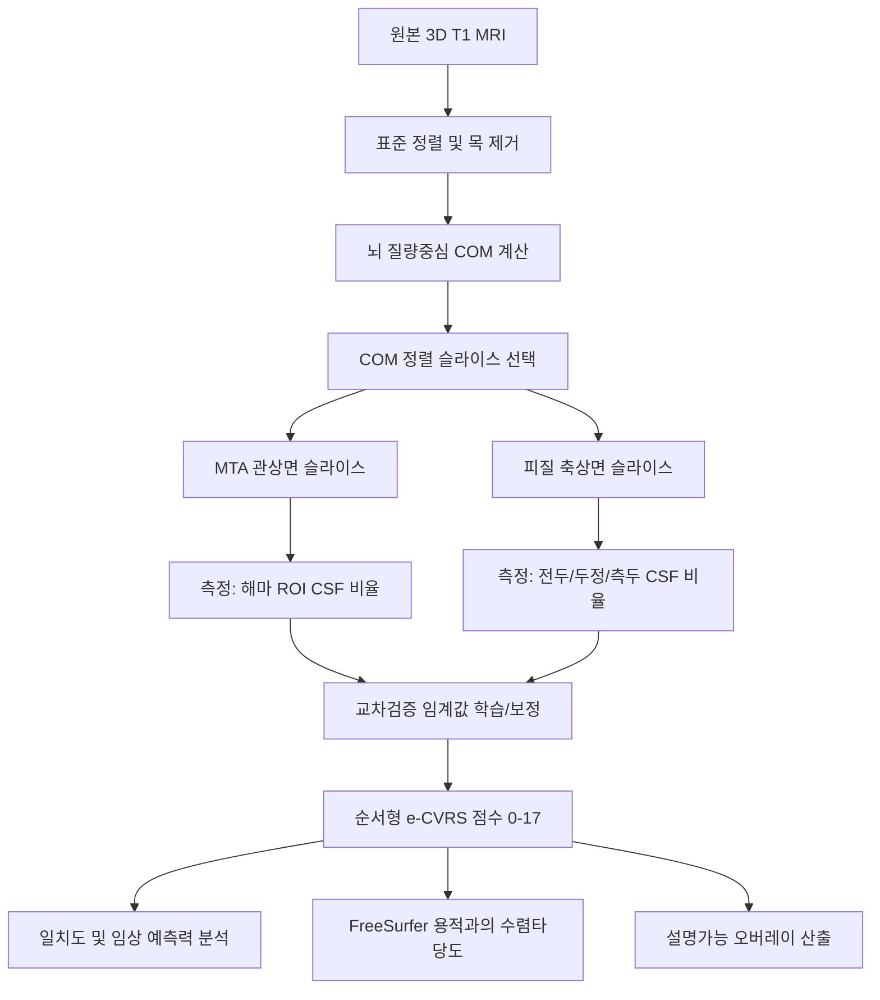

# 연구 프로토콜: ADNI MRI에서 T1 기반 자동 위축 시각평가척도(e-CVRS)

**자동 e-CVRS와 전문가 CVRS 판독의 일치도 및 용적측정과의 비교 검증**

> 문서 버전 2.0 · 최종 개정 2026-07-06 · 상태: 파일럿 결과 반영본
>
> **개정 요지:** 본 개정판은 340명 전체 코호트에 대해 실제로 파이프라인을 실행하여 얻은 교차검증 결과를 투명하게 반영한다. 초기 목표(ICC ≥ 0.80, 가중 카파 ≥ 0.60)는 현재 파이프라인에서 **아직 달성되지 않았으며**, 본 프로토콜은 (1) 결과를 정직하게 보고하고, (2) 논문화 및 임상적용이 가능한 수준으로 성능을 끌어올리기 위한 구체적 개선 로드맵을 제시하는 것을 목적으로 한다.

---

## 0. 현재 상태 요약 (Executive Summary)

340명 MCI 코호트 전체에 대해 자동 파이프라인을 실행하고 5-fold 교차검증으로 임계값을 보정하여 전문가 판독과 비교한 결과는 다음과 같다.

| 지표 | 대상 | 현재 결과 | 사전 목표 | 판정 |
| :--- | :--- | :--- | :--- | :--- |
| 가중 카파(κw) | 좌측 해마 (0–4) | 0.47 | ≥ 0.60 | 미달 |
| 가중 카파(κw) | 우측 해마 (0–4) | 0.37 | ≥ 0.60 | 미달 |
| 가중 카파(κw) | 전두엽 (0–3) | 0.33 | ≥ 0.60 | 미달 |
| 가중 카파(κw) | 두정엽 (0–3) | 0.41 | ≥ 0.60 | 미달 |
| 가중 카파(κw) | 측두엽 (0–3) | 0.51 | ≥ 0.60 | 미달(근접) |
| ICC(2,1) | 총 위축합(0–17) | 0.56 | ≥ 0.80 | 미달 |

**핵심 관찰 사항:**

1. **일치도는 현재 "보통(moderate)" 수준**이다. 측두엽(0.51)이 가장 우수하고 전두엽(0.33)이 가장 취약하다.
2. **탐색적 프록시 용적과의 상관은 약하고 일부는 부호가 뒤집혀 있다**(예: 전두엽 r = −0.19, 측두엽 r = −0.33). 이는 고정 크기 3D 바운딩 박스 기반 프록시 용적이 인접 뇌실·뇌구 CSF와 주변 조직을 함께 포함하여 생물학적 위축 신호를 신뢰성 있게 반영하지 못함을 시사한다. **따라서 박스 프록시 용적은 1차 비교자에서 제외하고, 실제 FreeSurfer 용적을 1차 비교자로 채택한다.**
3. **임상 상관은 전반적으로 약하며, 현재 e-CVRS는 수기 CVRS보다도 약하다**(MMSE: e-CVRS r = −0.11 vs 수기 r = −0.20). 다만 본 코호트는 **MCI 단일 진단군(MMSE 23–30, 평균 28.2±1.7)**으로 인지·중증도 범위가 매우 좁아, 모든 예측변수의 임상 상관이 구조적으로 약화(range restriction)되어 있다는 점을 반드시 고려해야 한다.

이 결과는 본 연구가 지향해야 할 지점을 분명히 한다. 즉, "속도와 설명가능성"이라는 강점을 유지하면서 **보정(calibration) 방법, 특징 추출의 강건성, 그리고 통계 검증의 엄밀성**을 개선하여 일치도를 임상 유용 수준으로 끌어올리는 것이다.

---

## 1. 연구 개요 및 배경 (Rationale)

전통적 MRI 용적측정(예: FreeSurfer)은 정밀한 3D 뇌 분할을 제공하지만 임상 현장에서 다음과 같은 장벽을 가진다.

- **긴 연산 시간** (표준 하드웨어에서 스캔당 수 시간).
- **스캐너 설정·잡음에 대한 높은 민감도** (1.5T vs 3.0T, 제조사 차이).
- **낮은 설명가능성** (블랙박스로 작동).

임상의는 빠르고 직관적이라는 이유로 일상 진료에서 **시각평가척도(Visual Rating Scale, VRS)**에 의존한다. 그러나 시각 척도는 **판독자 간 변동성**이 크다는 한계가 있다.

본 프로토콜은 **포괄적 시각평가척도(Comprehensive Visual Rating Scale, CVRS)의 위축 하위척도**를 재현하는 자동 알고리즘 **e-CVRS**의 개발과 검증을 기술한다. 뇌 질량중심(Center of Mass, COM) 정렬과 기하학적 규칙 기반 알고리즘을 결합하여 e-CVRS는 다음을 목표로 한다.

1. **설명가능 AI(XAI):** 어떤 근거로 점수가 부여되었는지를 보여주는 명시적 시각 지표(측정선, 비율, 뇌구 폭)를 산출한다.
2. **속도·효율:** 표준 CPU에서 초 단위의 준실시간 연산.
3. **스캐너 강건성:** 절대 복셀 수가 아닌 구조적 비율에 초점을 맞추어 스캐너 편차·자장 강도·움직임 아티팩트에 대한 내성 확보.

> [!NOTE]
> **연구 범위 한정:** 가용한 수기 판독과 정렬하기 위해 본 1차 연구의 범위는 **T1 기반 뇌 위축 e-CVRS(0–17점)**로 제한한다. 이는 해마 위축(좌/우, 0–4)과 피질 위축(전두·두정·측두엽, 0–3)을 포함한다. 소혈관질환(SVD) 요소(WMH, 열공, 미세출혈)는 FLAIR/T2* 시퀀스를 활용하는 2단계로 이연한다.

### 1.1 기여 및 논문화 관점 (Positioning)

현재 결과를 고려할 때, 본 연구의 논문화 기여는 "정확도에서 용적측정과 동등"이 아니라 **아래 세 축**으로 명확히 재정의한다.

- **방법론적 기여:** 외부 등록/분할 도구(FSL/ANTs/FreeSurfer) 의존 없이 순수 파이썬 COM 정렬만으로 재현 가능한, 완전 자동·설명가능한 위축 정량화 프레임워크를 제시.
- **투명한 벤치마크:** MCI 단일 코호트에서 규칙 기반 자동 VRS가 도달 가능한 성능의 상한과 한계를 데이터 누출 없이 정직하게 보고 — 후속 연구의 기준선.
- **임상 적용 경로:** 초 단위 연산과 오버레이 시각화를 통해 스크리닝·교육·판독 보조 도구로서의 실용성 입증.

---

## 2. 데이터셋 프로파일 (Dataset Profile)

본 연구는 **알츠하이머병 신경영상 이니셔티브(ADNI)** 데이터베이스의 **340명** 피험자를 대상으로 한다. 전원 원본 3D 구조 T1 강조 MRI(`.hdr`/`.img` Analyze 포맷)와 대응 임상 프로파일을 보유한다. 스캔 처리 시 340명이 성공적으로 특징 추출되었고, 수기 판독과의 병합 후 최종 분석 대상은 **339명**이다(RID 매칭 실패 1명 제외).

### 2.1 코호트 인구학·임상 기저치 (실제 데이터 기준)

| 지표 / 변수 | 기저 특성 (N = 340) |
| :--- | :--- |
| **연령(년)** | 72.6 ± 6.7 (범위: 55.0 – 91.4) |
| **성별(여/남)** | 45.5% 여 / 54.5% 남 |
| **APOE4 상태** | 보인자 45.9% (ε4 1개 36.5%, 2개 9.4%) / 비보인자 54.1% *(원자료 대립유전자 수 코딩 0/1/2 기준으로 정정)* |
| **진단(DX)** | 경도인지장애(MCI) 단일군 (MCI 339, NL→MCI 1) |
| **방문(VISCODE)** | 선별(sc) 시점 단면 |
| **MMSE** | 28.2 ± 1.7 (범위 23 – 30) |
| **CDR-SB** | 범위 0.5 – 5.5 |
| **ADAS-11** | 10.1 ± 4.5 |

> [!IMPORTANT]
> **범위 제한(range restriction) 경고:** 본 코호트는 MCI 단일군이며 MMSE가 23–30에 집중(평균 28.2)되어 있다. 인지·중증도 분포가 좁으면 어떤 영상 지표든 임상 척도와의 상관계수가 구조적으로 축소된다. 따라서 임상 예측 분석의 약한 상관은 지표 자체의 무효성이 아니라 **코호트 특성에 기인할 수 있으며**, 해석 시 반드시 명시한다. 가능하면 정상(CN)·치매(AD) 확장 코호트에서의 재현을 후속 과제로 둔다.

### 2.2 수기 시각평가 분포 (Ground Truth)

임상정보에 눈가림된 전문 신경과 전문의가 판독하였으며 검증 기준으로 사용한다.

- **해마 위축(MTA, Scheltens 척도, 좌/우: 0–4):**
  - 좌(Hippo_Lt): 0등급 76 | 1등급 103 | 2등급 106 | 3등급 52 | 4등급 3
  - 우(Hippo_Rt): 0등급 54 | 1등급 99 | 2등급 119 | 3등급 64 | 4등급 4
- **전반적 피질 위축(Koedam/Victoroff 척도, 전두/측두/두정: 0–3):**
  - 전두: 0등급 139 | 1등급 115 | 2등급 84 | 3등급 2
  - 두정: 0등급 75 | 1등급 98 | 2등급 128 | 3등급 39
  - 측두: 0등급 47 | 1등급 109 | 2등급 152 | 3등급 32

> [!NOTE]
> **클래스 불균형:** 해마 4등급(좌 3명, 우 4명)과 전두 3등급(2명)은 극단적으로 희소하다. 5-fold 분할 시 일부 fold에 상위 등급이 전혀 배정되지 않아 임계값 보정이 불안정해질 수 있다. 이는 현재 상위 등급 예측 실패 및 카파 저하의 주요 원인 중 하나이며, 층화(stratified) 분할과 인접 등급 병합(예: 3–4 통합) 민감도 분석으로 대응한다(§5).

---

## 3. 자동 위축 e-CVRS 알고리즘 파이프라인

해부학적 COM 정렬과 국소 기하 CSF 비율을 결합한 강건 파이프라인을 사용한다.

### Phase 1: 전처리 및 중심 표준화
1. **재정렬:** 모든 입력 영상을 표준 RAS 좌표로 변환하여 축 방향을 정규화한다.
2. **목 제거:** 뇌 최상단(z_top)을 자동 검출하고 z_top − 130 mm 미만 복셀을 0으로 클리핑하여 바운딩 박스 왜곡을 방지한다.
3. **질량중심(COM) 계산:** 목 제거된 두부 마스크의 3D 중심(x_com, y_com, z_com)을 계산한다. 스캐너 패딩·환자 평행이동에 불변인 강건한 해부학적 원점으로 사용한다.

> [!NOTE]
> **강도 정규화 추가(개선):** 현재 파이프라인은 98퍼센타일(I98)을 이용한 상대 임계값을 사용한다. 스캐너 간 강도 분포 차이를 더 강하게 흡수하기 위해, 백질 강도 피크 정규화 또는 뇌 마스크 내 z-score 정규화를 전처리에 추가하고, 정규화 유무에 따른 성능 차를 민감도 분석으로 보고한다.

### Phase 2: COM 정렬 슬라이스·ROI 선택
뇌 질량중심을 기준으로 물리 오프셋(mm)을 복셀 인덱스로 변환하여 ROI를 정의한다.

1. **해마 MTA(좌/우):** 관상면 y = y_com − 12 mm. 좌 ROI x ∈ [x_com−45, x_com−10], 우 ROI x ∈ [x_com+10, x_com+45], z ∈ [z_com−27, z_com−2] mm. 인접 5개 관상 슬라이스 평균으로 잡음을 완화한다.
2. **전두엽:** 축상면 z = z_com + 20 mm, y ∈ [y_com+10, y_com+50](전방), x ∈ [x_com−40, x_com+40].
3. **두정엽:** 축상면 z = z_com + 35 mm, y ∈ [y_com−50, y_com−10](후방), x ∈ [x_com−40, x_com+40].
4. **측두엽:** 축상면 z = z_com − 5 mm, 측방대 x ∈ [x_com−60, x_com−35] 및 [x_com+35, x_com+60], y ∈ [y_com−30, y_com+30].

> [!IMPORTANT]
> **ROI 검증(개선):** 고정 mm 오프셋 ROI가 실제 해부학적 표적을 포착하는지 확인하기 위해, 무작위 표본(예: 30명)에서 ROI 오버레이를 육안 검수하고 ROI 적중률을 정성 평가한다. 표적 이탈이 잦으면 COM 오프셋을 재보정하거나 경량 랜드마크(뇌실 중심, 정중시상면) 기반 보정을 도입한다.

### Phase 3: 특징 추출 및 임계값 보정
- 각 ROI에서 **국소 CSF 비율** R_CSF = (CSF 복셀 수) / (ROI 전체 복셀 수)를 계산한다. CSF는 보정된 강도 임계값(T_csf = factor × I98)으로 분할한다. 현재 factor는 부위별로 MTA 0.25, 전두 0.30, 두정 0.22, 측두 0.30을 사용한다.
- > [!IMPORTANT]
  > **데이터 누출 방지:** 전체 데이터에 대한 전역 순위 매핑을 배격한다. 연속 CSF 비율은 **5-fold 교차검증** 하에서 이산 점수(MTA 0–4, 피질 0–3)로 매핑한다. 임계 경계는 *훈련 fold*에서만 최적화하고 *검증 fold*에 적용하여 최종 일치 통계를 산출한다.

> [!WARNING]
> **현행 보정 방식의 한계(개선 핵심):** 현재 구현은 훈련 fold의 **수기 점수 주변분포(quantile matching)**를 그대로 재현하도록 임계값을 정한다. 이 방식은 예측 분포를 수기 분포에 맞출 뿐, 개별 사례의 순위 정확도를 최적화하지 않아 일치도 상한이 낮다. 개선안으로 (a) 비율→순서형 점수 매핑에 **순서형 로지스틱 회귀(proportional-odds)** 또는 등온회귀(isotonic)를 사용, (b) 부위별 CSF factor와 슬라이스 오프셋을 훈련 fold에서 검색(grid/Bayesian search)으로 공동 최적화, (c) 좌우 해마 등 대칭 부위는 특징을 결합하여 안정화하는 방안을 순차 검토한다.

---

## 4. 통계 검증 및 비교자 (Statistical Verification)

### 4.1 비교자 정의
용어 혼동을 피하기 위해 세 범주를 구분한다.

1. **자동 e-CVRS 점수(0–17):** 교차검증으로 매핑된 자동 시각평가 점수.
2. **3D 용적 비교자(1차):** **ADNI UCSF FreeSurfer 표준 용적표**를 RID로 매칭하여 1차 비교자로 사용한다(수렴타당도 검증). 미가용 시 SynthSeg/FastSurfer 등 로컬 분할로 대체한다.
3. **탐색적 프록시 용적(강등):** 경량 파이프라인의 3D 바운딩 박스 복셀 수(Vol_Hippo 등). **현행 결과에서 부호 불일치·약한 상관이 확인되어 1차 비교자에서 제외**하고, 파이프라인 내부 정합성 점검용 보조 지표로만 사용한다.

### 4.2 분석 1 — 정확도·일치도 (교차검증 집계)
- **방법:** 5-fold 교차검증 예측을 집계.
- **지표 및 신뢰구간:**
  - **ICC(2,1):** 연속 위축합 점수(0–17)의 일치도. **부트스트랩(예: 2,000회) 95% 신뢰구간**을 함께 보고한다. `pingouin.intraclass_corr` 등 검증된 구현으로 산출하여 자체 구현 결과와 교차확인한다.
  - **이차 가중 카파(κw):** 각 하위척도의 순서형 일치도. 부트스트랩 95% CI 동반.
  - **Bland–Altman 분석:** 수기−자동 총점 차이의 평균 편향과 일치 한계(LoA)를 시각화하여 계통 편향 유무를 평가한다.
  - **혼동행렬:** 부위별 등급 혼동행렬을 보고하여 오분류가 인접 등급에 국한되는지 확인한다.
- **현재 결과:** κw 0.33–0.51, ICC 0.56 (§0). **목표(ICC ≥ 0.80, κw ≥ 0.60)는 개선 로드맵(§5) 적용 후 재평가한다.**

### 4.3 분석 2 — 용적과의 수렴타당도
- **방법:** e-CVRS 점수(및 연속 CSF 비율)와 FreeSurfer 용적(두개내용적 ICV로 정규화) 간 Pearson/Spearman 상관.
- **가설:** 위축이 심할수록 CSF 비율↑·조직용적↓, 즉 **음의 상관**이 기대된다(부호 방향을 사전 명시).
- **주의:** 탐색적 박스 프록시 용적에서 관찰된 부호 역전은 프록시의 측정 한계를 보여주는 사례로 본문에 명시하고, 1차 결론은 FreeSurfer 기준으로만 도출한다.

### 4.4 분석 3 — 임상 예측력 (프로토콜–코드 정합화)
> [!WARNING]
> **기존 프로토콜–구현 불일치 정정:** 이전 프로토콜은 회귀 Model 1–4를 기술했으나 실제 코드는 단순 상관만 수행했다. 본 개정판은 아래 **위계적 회귀(nested regression)**를 실제 분석·구현 사양으로 확정한다.

- **결과변수:** MMSE, CDR-SB(연속), 그리고 필요 시 임상 진행(예: MCI→AD 전환, 종단 데이터 확보 시).
- **모형(위계적):**
  - Model 1: 공변량(연령, 성별, 교육연수, APOE4)
  - Model 2: 공변량 + 수기 CVRS
  - Model 3: 공변량 + e-CVRS
  - Model 4: 공변량 + 3D 용적(FreeSurfer)
- **검정:** 각 모형의 조정 R²(선형) 또는 우도비검정/ΔAUC(로지스틱, 이분 결과 시 DeLong 검정), 그리고 Model 3 대 Model 4의 **비열등성** 평가. 순서형 결과에는 비례오즈 순서형 로지스틱을 사용한다.
- **다중비교 보정:** 다수 하위척도·결과변수를 검정하므로 **Benjamini–Hochberg FDR**로 보정한 p값을 함께 제시한다.
- **현재 관찰:** e-CVRS–MMSE r = −0.11, 수기 r = −0.20, 해마용적 r = 0.06(모두 약함). 범위 제한 맥락에서 해석하며(§2.1), 개선된 e-CVRS로 재평가한다.

### 4.5 보고 표준
진단 정확도 요소는 **STARD 2015**, 임상 예측 요소는 **TRIPOD**(및 해당 시 TRIPOD-AI) 체크리스트를 준수하여 보고한다. 전 분석은 사전 등록 가능한 통계분석계획(SAP)으로 고정하여 사후 선택 편향을 통제한다.

---

## 5. 개선 로드맵 (Improvement Roadmap)

현재 "보통" 수준의 일치도를 임상 유용 수준으로 끌어올리기 위한 우선순위 개선안. 각 단계는 §4의 지표로 사전/사후 비교하며, 데이터 누출 방지 원칙(fold 내 학습)을 그대로 유지한다.

1. **보정 방식 고도화(최우선):** quantile matching → 순서형 로지스틱/등온회귀 기반 매핑으로 교체. 개별 순위 정확도를 직접 최적화한다.
2. **특징 강건화:** 백질 피크/z-score 강도 정규화 도입, 다중 슬라이스·부분용적 보정, 좌우 대칭 특징 결합, ROI 적중 검수 후 오프셋 재보정.
3. **부위별 하이퍼파라미터 공동 최적화:** CSF factor·슬라이스 오프셋·ROI 크기를 훈련 fold 내부에서 중첩 교차검증(nested CV)으로 탐색하여 검증 fold 성능을 최적화(누출 없이).
4. **클래스 불균형 대응:** 층화 K-fold, 희소 상위 등급 병합(예: MTA 3–4) 민감도 분석, 필요 시 순서형 손실 가중.
5. **스캐너 강건성 실증:** ADNI 다기관 특성을 활용해 **leave-one-site-out** 또는 자장강도(1.5T vs 3T) 층화 분석으로 "스캐너 강건성" 주장을 실제로 검정한다.
6. **수렴타당도 재확립:** 박스 프록시 대신 FreeSurfer 용적으로 §4.3 재수행.
7. **일반화 검증:** 가능 시 외부/확장 코호트(CN·AD 포함)에서 잠금된 임계값으로 재현.

각 단계 적용 후 §0 요약표를 갱신하고, 최종적으로 목표(ICC ≥ 0.80, κw ≥ 0.60) 달성 여부와 미달 시 임상적 함의를 정직하게 논의한다.

---

## 6. 한계 및 윤리 (Limitations & Ethics)

- **단일 코호트·단일 시점:** MCI 단면 데이터로, 범위 제한과 상위 등급 희소성이 성능·상관을 제약한다.
- **규칙 기반의 상한:** 고정 기하 규칙은 해부 변이·병리 혼재에 취약할 수 있으며, 학습 기반 보정으로 일부 완화하되 완전 대체하지 않는다(설명가능성 보존).
- **비교 기준의 한계:** FreeSurfer 역시 완벽한 정답이 아니며 수렴타당도 관점으로 해석한다.
- **연구용 한정:** 본 알고리즘은 연구 목적이며 의료기기가 아니다. 임상 의사결정 대체 용도로 사용하지 않는다.
- ADNI 데이터 사용 규정 및 IRB 승인·데이터 사용 협약을 준수한다.
