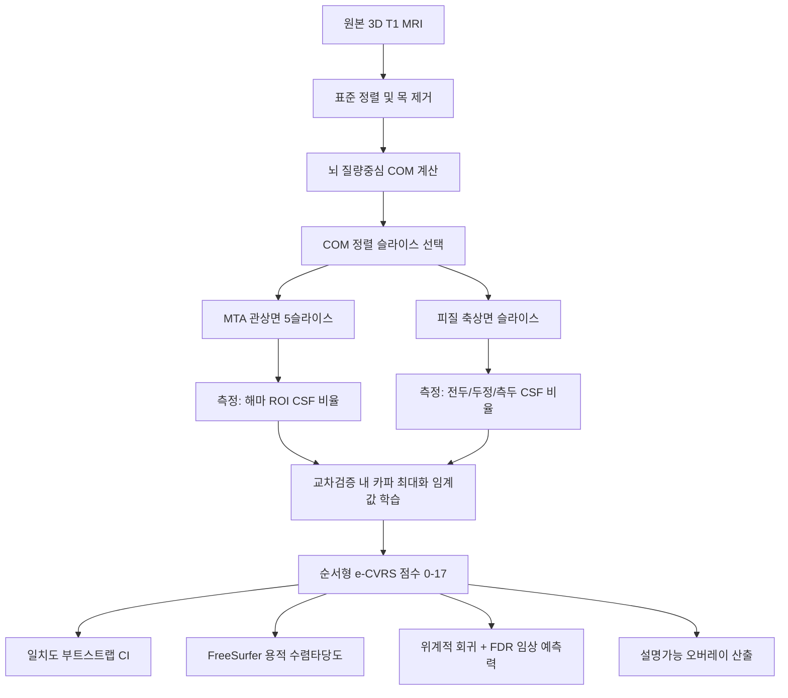

# 연구 프로토콜: ADNI MRI에서 T1 기반 자동 위축 시각평가척도(e-CVRS)

**자동 e-CVRS와 전문가 CVRS 판독의 일치도 및 용적측정과의 비교 검증**

> 문서 버전 3.0 · 최종 개정 2026-07-07 · 상태: 논문 초안 v3와 정합화(원자료 재검증 반영)
>
> **개정 요지:** 본 개정판은 (1) 원자료(`ADNI_MRI_rating.xlsx`)와 자동 특징표(`e-CVRS_automated_scores.csv`)를 직접 재검증하여 **대상자 수·인구학 수치를 정정**하고, (2) 임계값 보정을 카파 최대화(Nelder–Mead) 방식으로, 통계 검증을 부트스트랩 신뢰구간·위계적 회귀·FDR 보정으로 **고도화한 논문 초안 v3의 방법론에 프로토콜을 일치**시키며, (3) 사전 목표치와 "비열등성" 표현을 실제 결과와 검정 설계에 맞추어 **정직하게 재정의**한 것이다.
>
> **⚠ 미해결 정합성 이슈(§0.1 참조):** 논문 초안 v3는 분석 대상을 "339명(손상 1명 제외)"으로 기술하나, 원자료 재검증 결과 **실제 병합 분석 대상은 338명**이며 특징추출 실패는 2건(RID 4212, 4764), 수기 판독 결측 1건(RID 4917)이다. 본 프로토콜은 검증된 338명 기준으로 기술하며, 논문 본문의 대상자 수 문구는 이에 맞추어 정정이 필요하다.

---

## 0. 현재 상태 요약 (Executive Summary)

ADNI MCI 코호트에 대해 자동 파이프라인을 실행하고, 데이터 누출을 차단한 5-fold 교차검증에서 **훈련 fold의 가중 카파를 최대화하는 임계값(Nelder–Mead)**을 학습하여 검증 fold에 적용, 전문가 판독과 비교한 결과는 다음과 같다(부트스트랩 2,000회 95% CI 동반).

| 지표 | 대상 | 결과 (95% CI) | 사전 목표 | 판정(Landis–Koch) |
| :--- | :--- | :--- | :--- | :--- |
| 가중 카파(κw) | 측두엽 (0–3) | 0.4953 (0.4099–0.5749) | ≥ 0.60 | moderate |
| 가중 카파(κw) | 좌측 해마 (0–4) | 0.4669 (0.3832–0.5433) | ≥ 0.60 | moderate |
| 가중 카파(κw) | 두정엽 (0–3) | 0.3986 (0.3144–0.4818) | ≥ 0.60 | fair(상한)/moderate 경계 |
| 가중 카파(κw) | 우측 해마 (0–4) | 0.3877 (0.2923–0.4738) | ≥ 0.60 | fair |
| 가중 카파(κw) | 전두엽 (0–3) | 0.3419 (0.2388–0.4363) | ≥ 0.60 | fair |
| ICC(2,1) | 총 위축합 (0–17) | 0.5746 (0.4985–0.6425) | ≥ 0.80 | moderate |

**핵심 관찰 사항:**

1. **일치도는 전반적으로 fair-to-moderate 수준**이다. 측두엽·좌측 해마가 가장 우수하고 전두엽·우측 해마가 가장 취약하다. 총합 ICC의 CI 하한(0.50)이 moderate 경계에 근접해 규칙 기반 접근의 기본 강건성을 시사한다.
2. **탐색적 프록시 용적과의 상관은 약하고 일부는 부호가 뒤집히거나 산출 불가(NaN)**였다(전두 r ≈ −0.12, 두정·측두는 현행 구현에서 NaN). 고정 크기 3D 바운딩 박스 프록시가 인접 뇌실·뇌구 CSF와 조직을 함께 포함하여 생물학적 위축 신호를 신뢰성 있게 반영하지 못함을 보여준다. **따라서 박스 프록시 용적은 1차 비교자에서 제외하고, 실제 FreeSurfer 용적을 1차 비교자로 채택한다.**
3. **임상 예측 증분은 유의하지 않다.** MMSE에 대한 위계적 회귀에서 공변량 기저모형(adjusted R²=0.0851) 대비 e-CVRS(0.0850), 3D 프록시(0.0866)의 독립 증분은 유의하지 않았고, 수기 CVRS도 FDR 보정 후 유의성을 상실했다(§4.4). 이는 지표의 무효가 아니라 **MCI 단일군의 MMSE 범위 제한(23–30, 평균 28.2±1.7)**에 상당 부분 기인한다.

이 결과는 본 연구의 논문화 축을 "정확도에서 용적측정과 동등"이 아니라 **재현 가능·설명가능한 경량 프레임워크의 투명한 벤치마크와 그 한계·개선 경로 제시**로 재정의하도록 이끈다.

### 0.1 대상자 수 정합성 (Subject Accounting) — 원자료 검증 결과

| 단계 | N | 비고 |
| :--- | :--- | :--- |
| 원본 T1 스캔(.hdr/.img) | 341 | 파일명 `_S_(RID)_` 파싱 |
| 특징추출 성공 | 339 | 실패 2건: RID 4212(파일 절단·손상, 9.5 MB), RID 4764(로딩 실패) |
| 수기 판독 풀 | 340 | `ADNI_MRI_rating.xlsx` |
| **최종 병합 분석 대상** | **338** | 특징은 있으나 수기 판독 결측 1건(RID 4917) 제외 |

> [!IMPORTANT]
> 논문 초안 v3의 "341명 중 1명(RID 4212) 제외 → 339명"이라는 문구는 실제 파이프라인 출력과 불일치한다. Table 1의 인구학 수치는 **N=338**에 대해 정확히 재현되므로, 논문 본문·표의 대상자 수를 **338명**으로, 제외 사유를 "특징추출 실패 2건 + 수기 판독 결측 1건"으로 정정할 것을 권고한다.

---

## 1. 연구 개요 및 배경 (Rationale)

전통적 MRI 용적측정(예: FreeSurfer)은 정밀한 3D 뇌 분할을 제공하지만 임상 현장에서 다음 장벽을 가진다: 긴 연산 시간(표준 하드웨어에서 스캔당 수십 분~수 시간), 스캐너 설정·잡음에 대한 높은 민감도(1.5T vs 3.0T, 제조사 차이), 낮은 설명가능성(블랙박스). 임상의는 빠르고 직관적이라는 이유로 일상 진료에서 **시각평가척도(VRS)**에 의존하나, 시각 척도는 **판독자 간 변동성**이 크다.

본 프로토콜은 **포괄적 시각평가척도(CVRS)의 위축 하위척도**를 재현하는 자동 알고리즘 **e-CVRS**의 개발·검증을 기술한다. 뇌 질량중심(COM) 정렬과 기하 규칙 기반 알고리즘을 결합하여 다음을 목표로 한다.

1. **설명가능 AI(XAI):** 점수 근거를 보여주는 명시적 시각 지표(측정선, 비율, 뇌구 폭) 산출.
2. **속도·효율:** 외부 신경영상 스위트 없이 표준 CPU에서 초 단위 연산.
3. **스캐너 강건성:** 절대 복셀 수가 아닌 구조적 비율에 초점을 맞춰 스캐너 편차·자장 강도·움직임 아티팩트에 대한 내성 확보.

> [!NOTE]
> **연구 범위 한정:** 가용 수기 판독과 정렬하기 위해 본 1차 연구는 **T1 기반 뇌 위축 e-CVRS(0–17점)**로 제한한다. 해마 위축(좌/우, 0–4)과 피질 위축(전두·두정·측두엽, 0–3)을 포함한다. 소혈관질환(SVD) 요소(WMH·열공·미세출혈)는 FLAIR/T2* 시퀀스를 요하므로 2단계로 이연한다.

### 1.1 기여 및 논문화 관점 (Positioning)

현재 결과를 고려할 때 논문화 기여를 아래 세 축으로 정의한다.

- **방법론적 기여:** 외부 등록/분할 도구(FSL/ANTs/FreeSurfer) 의존 없이 순수 파이썬 COM 정렬만으로 재현 가능한, 완전 자동·설명가능 위축 정량화 프레임워크를 제시.
- **투명한 벤치마크:** MCI 단일 코호트에서 규칙 기반 자동 VRS가 도달 가능한 성능의 상한·한계를 데이터 누출 없이 정직하게 보고 — 후속 연구의 기준선.
- **엄밀한 검증:** fold 내부 학습·부트스트랩 CI·위계적 회귀·FDR 보정으로 불확실성 정량화와 다중검정 통제를 갖춘 재현 가능한 검증 설계.

---

## 2. 데이터셋 프로파일 (Dataset Profile)

본 연구는 **ADNI** 데이터베이스의 T1 강조 MRI(`.hdr`/`.img` Analyze 포맷)와 대응 임상 프로파일을 사용한다. 대상자 수 정합성은 §0.1에 상술하였으며, **최종 분석 대상은 338명**이다. 본 연구는 진단정확도·예측모형 보고를 위해 **STARD 2015** 및 **TRIPOD** 권고를 참고한다.

### 2.1 코호트 인구학·임상 기저치 (원자료 재검증, N = 338)

| 지표 / 변수 | 기저 특성 (N = 338) |
| :--- | :--- |
| **연령(년)** | 71.3 ± 7.4 (범위 55.0 – 91.4) |
| **성별(여/남)** | 46.7% 여(158) / 53.3% 남(180) |
| **교육연수(년)** | 16.3 ± 2.6 |
| **APOE4 상태** | 보인자 46.2% (ε4 1개 36.7%, 2개 9.5%) / 비보인자 53.8% |
| **MMSE** | 28.2 ± 1.7 (범위 23 – 30) |
| **CDR-SB** | 1.5 ± 0.9 |
| **ADAS-11** | 9.0 ± 4.3 |
| **진단(DX)** | MCI 단일군 (MCI 337, NL→MCI 1) |

> [!IMPORTANT]
> **범위 제한(range restriction) 경고:** 본 코호트는 MCI 단일군이며 MMSE가 23–30(평균 28.2)에 집중되어 있다. 종속변수 분산이 좁으면 어떤 영상 지표든 임상 척도와의 상관·결정계수가 구조적으로 축소된다. 임상 예측 분석의 약한 상관은 지표 자체의 무효가 아니라 **코호트 특성에 기인할 수 있으므로** 해석 시 반드시 명시하고, 정상(CN)·치매(AD) 포함 확장 코호트에서의 재현을 후속 과제로 둔다.

### 2.2 수기 시각평가 분포 (Ground Truth, 분석 대상 N = 338)

임상정보에 눈가림된 신경과 전문의가 판독한 값을 검증 기준으로 사용한다. 아래 분포는 **병합 분석 대상 338명** 기준이며, 해마 MTA는 Scheltens [4]·T1 축상 변형 [5] 계열, 피질은 Victoroff [6]/Koedam [7] 계열이다.

- **해마 위축(MTA, 좌/우: 0–4):**
  - 좌(Hippo_Lt): 0등급 76 | 1등급 102 | 2등급 105 | 3등급 52 | 4등급 3
  - 우(Hippo_Rt): 0등급 54 | 1등급 98 | 2등급 118 | 3등급 64 | 4등급 4
- **전반적 피질 위축(전두/두정/측두: 0–3):**
  - 전두: 0등급 138 | 1등급 115 | 2등급 83 | 3등급 2
  - 두정: 0등급 74 | 1등급 98 | 2등급 127 | 3등급 39
  - 측두: 0등급 47 | 1등급 108 | 2등급 152 | 3등급 31

> [!NOTE]
> **클래스 불균형:** 해마 4등급(좌 3명, 우 4명)과 전두 3등급(2명)은 극단적으로 희소하다. 5-fold 분할 시 일부 fold에 상위 등급이 배정되지 않아 임계값 보정이 불안정해질 수 있으며, 이는 우측 해마·전두엽 카파 저하의 주요 원인 중 하나이다. 층화(stratified) 분할과 인접 상위등급 병합(예: MTA 3–4) 민감도 분석으로 대응한다(§5).

---

## 3. 자동 위축 e-CVRS 알고리즘 파이프라인

해부학적 COM 정렬과 국소 기하 CSF 비율을 결합한 강건 파이프라인을 사용한다. 재현을 위한 수식 사양은 논문 초안 v3 §2.3과 동일하다.

### Phase 1: 전처리 및 중심 표준화
1. **복셀 간격 추출·재정렬:** 아핀 행렬 대각성분에서 물리 복셀 해상도(S_x, S_y, S_z)를 얻고, 좌표계를 표준 RAS로 표준화한다.
2. **목 제거(Neck Stripping):** 다운샘플(step=2)에서 98퍼센타일 강도 I98을 산출하고 0.12×I98로 이진 뇌 마스크를 생성, 최상단 z_top을 검출한 뒤 물리 높이 130 mm 이하를 제거한다: **z_limit = z_top − round(130 / S_z)**.
   - > [!WARNING]
     > **구현 정정 필요:** 현행 코드(`e_cvrs_pipeline.py`)는 `z_limit = int(z_top − 130)`으로 130을 **복셀 수**로 취급하여, 등방 1 mm가 아닌 스캔에서 물리적 130 mm와 어긋난다. `int(z_top − round(130/S_z))`로 정정해야 사양과 일치한다(§implementation_plan).
3. **질량중심(COM) 계산:** 목 제거된 두부 마스크의 3D 산술평균 중심(x_com, y_com, z_com)을 계산한다. 스캐너 패딩·환자 평행이동에 불변한 해부학적 원점이다.

> [!NOTE]
> **강도 정규화(개선):** 현행은 I98 기반 상대 임계값을 사용한다. 스캐너 간 강도 분포 차를 더 강하게 흡수하기 위해 백질 강도 피크 정규화 또는 뇌 마스크 내 z-score 정규화를 도입하고, 정규화 유무에 따른 성능 차를 민감도 분석으로 보고한다(§5).

### Phase 2: COM 정렬 슬라이스·ROI 선택
물리 오프셋(mm)을 복셀 인덱스로 변환하여 ROI를 정의한다.

1. **해마 MTA(좌/우):** 관상면 y = y_com − 12 mm를 중심으로 **전후 ±2 슬라이스(총 5개)를 평균**. X 오프셋 ±28 mm(폭 35 mm), Z 오프셋 −12 mm(폭 25 mm). 즉 좌 x ∈ [x_com−45.5, x_com−10.5], 우 x ∈ [x_com+10.5, x_com+45.5], z ∈ [z_com−24.5, z_com+0.5] mm.
2. **전두엽:** 축상면 z = z_com + 20 mm, y ∈ [y_com+10, y_com+50](전방), x ∈ [x_com−40, x_com+40].
3. **두정엽:** 축상면 z = z_com + 35 mm, y ∈ [y_com−50, y_com−10](후방), x ∈ [x_com−40, x_com+40].
4. **측두엽:** 축상면 z = z_com − 5 mm, 측방대 x ∈ [x_com−60, x_com−35] 및 [x_com+35, x_com+60], y ∈ [y_com−30, y_com+30].

> [!IMPORTANT]
> **ROI 검증(개선):** 고정 mm 오프셋 ROI가 실제 해부 표적을 포착하는지 확인하기 위해, 무작위 표본(예: 30명)에서 ROI 오버레이를 육안 검수하고 적중률을 정성 평가한다. 표적 이탈이 잦으면 COM 오프셋을 재보정하거나 경량 랜드마크(뇌실 중심, 정중시상면) 기반 보정을 도입한다.

### Phase 3: 특징 추출
- 각 ROI에서 **국소 CSF 비율** R_CSF = (T_csf 미만 복셀 수) / (ROI 전체 복셀 수)를 계산한다. CSF 임계값은 T_csf = factor × I98이며, factor는 부위별로 **MTA 0.25, 전두 0.30, 두정 0.22, 측두 0.30**을 고정 적용한다.
- 파이프라인은 내부 정합성 점검용 3D 박스 프록시 용적(Vol_Hippo_Lt/Rt, Vol_Ventricle, Vol_TBV 등)도 산출하나, §0·§4.1에 따라 1차 비교자에서는 제외한다.

---

## 4. 통계 검증 및 비교자 (Statistical Verification)

### 4.1 비교자 정의
1. **자동 e-CVRS 점수(0–17):** 교차검증으로 매핑된 자동 시각평가 점수.
2. **3D 용적 비교자(1차):** **ADNI UCSF FreeSurfer 표준 용적표**를 RID로 매칭하여 1차 비교자로 사용(수렴타당도). 미가용 시 SynthSeg/FastSurfer 등 로컬 분할로 대체.
3. **탐색적 프록시 용적(강등):** 경량 파이프라인의 3D 박스 복셀 수. 현행 결과에서 부호 불일치·NaN이 확인되어 1차 비교자에서 제외하고 보조 지표로만 사용.

### 4.2 임계값 보정 — 카파 최대화 (Nelder–Mead)
> [!IMPORTANT]
> **데이터 누출 방지:** 전역 순위 매핑을 배격하고, 연속 R_CSF를 이산 점수(MTA 0–4, 피질 0–3)로 매핑하는 임계 경계벡터 θ를 **5-fold 교차검증의 훈련 fold에서만** 학습한다.

- **목적함수:** 훈련 fold에서 예측 등급 ŷ(θ)와 수기 등급 y 간 **이차 가중 카파 κw를 최대화**(손실 = −κw)한다. 예측 규칙은 ŷ_i(θ) = Σ_c 𝟙(R_CSF,i ≥ θ_c).
- **최적화:** 단계식 손실의 불연속성 때문에 비구배 기법인 **Nelder–Mead simplex**를 사용한다.
- **초기값:** 훈련 fold 등급 빈도의 누적 백분위수에 대응하는 R_CSF 값(quantile matching)을 초기 θ⁰로 인가한다. *quantile matching은 최종 매핑이 아니라 초기화 용도이다.*
- **적용:** 정렬로 경계 모순을 제거한 θ*를 격리된 검증 fold에 적용하여 누출 없는 예측을 산출, 전 fold를 병합해 통계를 계산한다.

### 4.3 분석 1 — 정확도·일치도 (교차검증 집계)
- **지표 및 CI:**
  - **ICC(2,1):** 양방향 무작위 absolute agreement 모델로 총 위축합(0–17) 일치도. **부트스트랩 2,000회 95% CI** 동반.
  - **이차 가중 카파(κw):** 각 하위척도의 순서형 일치도. 부트스트랩 95% CI 동반.
  - **Bland–Altman:** 수기−자동 총점 차의 평균 편향·일치한계(LoA) 시각화.
  - **혼동행렬:** 부위별 오분류가 인접 등급에 국한되는지 확인.
- **검증 구현:** 자체 κw·ICC·회귀 모듈은 scikit-learn·pingouin과 소수점 4자리까지 교차확인한다.
- **결과:** κw 0.34–0.50, ICC 0.5746 (§0). **목표(ICC ≥ 0.80, κw ≥ 0.60)는 사전 목표치이며 현 파이프라인에서는 미달**이다. 개선 로드맵(§5) 적용 후 재평가한다.

### 4.4 분석 2 — 임상 예측력 (위계적 회귀 + FDR)
> [!WARNING]
> **프로토콜–구현 정합화:** 이전 판은 회귀 Model 1–4를 기술했으나 초기 코드는 단순 Pearson 상관만 수행했다. 본 개정판은 아래 **위계적 회귀**를 확정 사양으로 삼으며, 논문 초안 v3 Table 3과 일치한다.

- **결과변수:** MMSE(주분석). 종단 데이터 확보 시 CDR-SB·MCI→AD 전환으로 확장.
- **모형(위계적):**
  - Model 1: 공변량(연령·성별·교육연수·APOE4)
  - Model 2: + 수기 CVRS 합계
  - Model 3: + 자동 e-CVRS 합계
  - Model 4: + 3D 용적(1차: FreeSurfer, 현행: 해마 프록시)
- **검정:** 증분 F검정으로 조정 R² 증분의 유의성을 평가하고, 3개 영상 추가 모형에 **Benjamini–Hochberg FDR**로 α=0.05를 통제한다.
- **결과(N=338):** Model 1 R²=0.0851; +수기 CVRS 0.0937(p=0.042, FDR p=0.126); +e-CVRS 0.0850(p=0.329); +3D 프록시 0.0866(p=0.216, FDR p=0.324). **어떤 영상지표도 유의한 독립 증분을 보이지 못했으며**, 수기 CVRS조차 FDR 보정 후 유의성을 잃었다 — 범위 제한이 특정 지표가 아닌 코호트 구조의 문제임을 방증한다.

### 4.5 분석 3 — 용적과의 수렴타당도
- **방법:** e-CVRS 점수(및 연속 R_CSF)와 FreeSurfer 용적(ICV 정규화) 간 Pearson/Spearman 상관.
- **가설·부호:** 위축이 심할수록 CSF 비율↑·조직용적↓ → **음의 상관**을 사전 명시한다.
- **주의:** 탐색적 박스 프록시의 부호 역전·NaN은 프록시 측정 한계 사례로 본문에 명시하고, 1차 결론은 FreeSurfer 기준으로만 도출한다.

### 4.6 "동등성/비열등성"에 대한 해석 원칙
> [!IMPORTANT]
> e-CVRS와 3D 프록시가 **둘 다 유의하지 않다는 사실**은 "차이 없음의 증거"가 아니라 "증거의 부재"이다(absence of evidence ≠ evidence of absence). **사전 정의된 동등성 마진 기반 검정(예: TOST)** 없이는 비열등·동등을 단정하지 않는다. 특히 범위 제한으로 검정력이 낮은 상황에서는 진짜 차이도 탐지되지 않을 수 있다. 따라서 본 연구는 "탐색적으로 유사한 수준"으로만 기술하고, 형식적 비열등 결론은 충분한 분산·검정력을 확보한 코호트에서 사전 마진을 정의한 설계로 유보한다.

---

## 5. 개선 로드맵 (Improvement Roadmap)

fair-to-moderate 일치도를 임상 유용 수준으로 끌어올리기 위한 우선순위. 각 단계는 §4 지표로 사전/사후 비교하며 fold 내부 학습 원칙을 유지한다.

1. **보정 방식 심화:** 카파 최대화(현행)에 더해 비율→순서형 매핑에 **순서형 로지스틱(proportional-odds)·등온회귀(isotonic)**를 도입하고, 상위 등급 희소성에 강한 손실을 비교한다.
2. **특징 강건화:** 백질 피크/z-score 강도 정규화, 다중 슬라이스·부분용적 보정, 좌우 대칭 특징 결합, ROI 적중 검수 후 오프셋 재보정.
3. **하이퍼파라미터 공동 최적화:** 부위별 CSF factor·슬라이스 오프셋·ROI 크기를 훈련 fold 내부 **중첩 교차검증(nested CV)**으로 탐색(누출 없이).
4. **클래스 불균형 대응:** **층화 K-fold**, 희소 상위등급 병합(예: MTA 3–4) 민감도 분석, 순서형 손실 가중.
5. **스캐너 강건성 실증:** ADNI 다기관 특성을 이용해 **leave-one-site-out** 또는 자장강도(1.5T vs 3T) 층화로 "강건성" 주장을 실제 검정.
6. **수렴타당도 재확립:** 박스 프록시 대신 FreeSurfer 용적으로 §4.5 재수행.
7. **일반화 검증:** CN·AD 포함 확장/외부 코호트에서 잠금된 임계값으로 재현.

각 단계 적용 후 §0 요약표를 갱신하고, 최종적으로 사전 목표 달성 여부와 미달 시 임상적 함의를 정직하게 논의한다.

---

## 6. 한계 및 윤리 (Limitations & Ethics)

- **단일 코호트·단일 시점:** MCI 단면 데이터로, 범위 제한과 상위 등급 희소성이 성능·상관을 제약한다.
- **규칙 기반의 상한:** 고정 기하 규칙은 해부 변이·병리 혼재에 취약할 수 있으며, 학습 기반 보정으로 일부 완화하되 완전 대체하지 않는다(설명가능성 보존).
- **비교 기준의 한계:** FreeSurfer 역시 완벽한 정답이 아니며 수렴타당도 관점으로 해석한다. 수기 판독의 판독자 수·판독자 간 신뢰도 정보가 제한적이어서 기준 잡음이 상한에 미친 영향을 완전히 분리하지 못했다.
- **연구용 한정:** 본 알고리즘은 연구 목적이며 의료기기가 아니다. 임상 의사결정 대체 용도로 사용하지 않는다.
- **윤리·데이터:** ADNI는 각 기관 IRB 승인·서면 동의 하에 수집된 공개·비식별 2차 데이터이며, 본 연구는 데이터 사용 협약과 소속기관 IRB 규정을 준수한다.

---

## 부록 A. 참고문헌(핵심)

논문 초안 v3의 References와 동일 번호 체계를 사용한다. 핵심: CVRS 개발·검증 [1–3], MTA/피질 척도 [4–8], 구조 MRI 임상활용 [9], ADNI MRI 방법 [10], 자동 분할 [11–13], 설명가능성 [14], 통계(가중 카파·ICC·Bland–Altman·FDR) [16–20], 보고표준(STARD·TRIPOD) [21–22], SVD 척도 [23].
